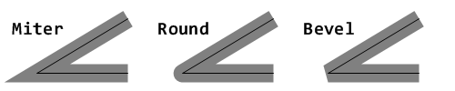

= Dialekt Draw
:imagesdir: ../images
:toc:
:toc-title:
:toclevels: 3
:numbered:

== Anotace

*Draw* je dialekt jazyka (Domain Specific Languge) Red, který poskytuje jednoduchý deklarativní způsob kreslení rovinných útvarů. Operace kreslení jsou vyjádřeny jako seznamy uspořádaných příkazů (používajících bloky hodnot), které je snadné sestavovat a měnit při běhu programu.

Bloky dialektu Draw lze vykreslovat přímo do obrázku s použitím funkce `draw` nebo uvnitř piškotu (face) View s použitím aspektu `draw` (viz link:view.adoc[dokumentace View]).

== Příkazy 'draw'

Příkazy mohou být kreslící instrukce nebo nastavení kreslících instrukcí. Je-li nastaven určitý režim, platí pro všechny následující operace aktuální seance Draw.

Většina kreslících příkazů je doplněna určením souřadnic. Používá se tento systém souřadnicových os:

* osa x: kladná hodnota směřuje vpravo.
* osa y: kladná hodnota směřuje dolů.

Některé příkazy zahrnují určení délky. Délka se udává v pixelech.

image::../images/coord-system.png[Coord-system,align="center"]

=== Line

*Syntaxe*

----
line <point1> <point2> ...
    
<point> : souřadnice bodu (pair!).
----
    
*Popis*

Příkaz nakreslí přímku (line) mezi dvěma body. Je-li zadáno více bodů, kreslí se další přímky v daném pořadí.

=== Triangle

*Syntaxe*
----
triangle <point1> <point2> <point3>
    
<point> : souřadnice vrcholu trojúhelníku (pair!).
----

[NOTE]
====
 Vrchol (vertex) je bod, kde se setkávají dvě přímky trojúhelníka.
====
    
*Popis*

Nakreslí trojúhelník (triangle) se stranami mezi zadanými vrcholy.

=== Box 

*Syntaxe*
----
box <top-left> <bottom-right>
box <top-left> <bottom-right> <corner>
    
<top-left>     : souřadnice levého horního rohu obdélníka (pair!).
<bottom-right> : souřadnice pravého dolního rohu obdélníka (pair!).
<corner>       : (nepovinné) poloměr oblouku při kreslení zaoblených rohů (integer!).
----
    
*Popis*

Nakreslí obdélník (box), daný polohou levého horního (první argument) a pravého dolního (druhý argument) rohu. Nepovinný poloměr určuje poloměr zaoblení jeho rohů.

=== Polygon

*Syntaxe*
----
polygon <point> <point> ...
    
<point> : souřadnice vrcholu (pair!).
----
    
*Popis*

Nakreslí mnohoúhelník (polygon) s použitím zadaných vrcholů. Poslední zadaný vrchol nemusí být vrcholem výchozím, neboť si funkce závěrnou stranu nakreslí sama. Minimální počet zadaných bodů je 3.

=== Circle

*Syntaxe*
----
circle 
 <radius>
circle 
 <radius-x> <radius-y>
    

   : souřadnice středu kružnice (pair!). <radius>   : poloměr kružnice (integer! float!).
<radius-x> : (režim elipsy) poloměr kružnice ve směru osy X (integer! float!).
<radius-y> : (režim elipsy) poloměr kružnice ve směru osy Y (integer! float!).
----
    
*Popis*

Nakreslí kružnici (circle) z daného středu o daném poloměru. Kružnice může být deformována na elipsu přidáním dalšího argumentu, představujícího poloměr ve směru osy Y (čímž se z prvního poloměru stává poloměr ve směru osy X).

=== Ellipse  

*Syntaxe*
----
ellipse <top-left> <size>
    
<top-left> : souřadnice levého horního rohu opsaného obdélníka (pair!).
<size>     : velikost opsaného obdélníka (pair!).
----
    
*Popis*

Nakreslí elipsu v opsaném obdélníku. Argument `size` představuje rozměry obdélníka.

NOTE:  Příkaz `ellipse` je pregnantnější než elipsa coby deformovaná kružnice (`circle`).

=== Arc

*Syntaxe*
----
arc 
 <radius> <begin> <sweep>
arc 
 <radius> <begin> <sweep> closed
    

 : souřadnice středu kruhového oblouku (pair!).
<radius> : poloměr kruhového oblouku (pair!).
<begin>  : počáteční úhel průvodiče ve stupních (integer!).
<sweep>  : úhel mezi počátečním a koncovým průvodičem oblouku ve stupních (integer!).
----
    
*Popis*

Nakreslí kruhový oblouk (arc) se zadaným středem a poloměrem. Průběh oblouku je určen dvěma úhly. Nepovinné klíčové slovo `closed` doplní oblouk na kruhovou výseč.

=== Curve

*Syntaxe*
----
curve <end-A> <control-A> <end-B>
curve <end-A> <control-A> <control-B> <end-B>
    
<end-A>     : koncový bod A (pair!).
<control-A> : kontrolní bod A (pair!).
<control-B> : kontrolní bod B (pair!).
<end-B>     : koncový bod B (pair!).
----	

*Popis*

Nakreslí Beziérovu křivku (curve) ze 3 nebo 4 bodů:

* 3 body: 2 koncové, 1 kontrolní - pro křivku kvadratickou
* 4 body: 2 koncové, 2 kontrolní - pro křivku kubickou

Zadají-li se více než 4 body, je poslední zadaný ignorován.

=== Spline

*Syntaxe*
----
spline <point> <point> ...
spline <point> <point> ... closed
    
<point> : kontrolní bod (pair!).
----

*Popis*

Nakreslí polynomickou bázovou křivku (b-spline) pro zadané alespoň tři body. Nepovinné klíčové slovo `closed` uzavře křivku spojnicí mezi koncem a počátkem.

[NOTE]
====
Dva body jsou akceptovány, vrací se ale přímka.
====

=== Image

*Syntaxe*
----
image <image>
image <image> <top-left>
image <image> <top-left> <bottom-right>
image <image> <top-left> <top-right> <bottom-left> <bottom-right>
image <image> <top-left> <top-right> <bottom-left> <bottom-right> <color>
image <image> <top-left> <top-right> <bottom-left> <bottom-right> <color> border
image <image> <top-left> <top-right> <bottom-left> <bottom-right> <color> crop <offset> <size>
    
<image>        : zobrazovaný obrázek (image! word!).
<top-left>     : (nepovinné) souřadnice levého horního okraje (pair!).
<top-right>    : (nepovinné) souřadnice pravého horního okraje (pair!).
<bottom-left>  : (nepovinné) souřadnice levého dolního okraje (pair!).
<bottom-right> : (nepovinné) souřadnice pravého dolního okraje (pair!).
<color>        : (nepovinné) transparentně zobrazená barva(tuple! word!)
<offset>       : (nepovinné) poloha pro začátek zkrácení (pair!).
<size>         : (nepovinné) velikost zkrácení (pair!).
----
    
*Popis*

Nakreslí obrázek s použitím poskytnuté inforace o pozici a šířce. Nemá-li obrázek zadané poziční informace, potom je nakreslen v souřadnici 0x0. Případně poskytnutá hodnota barvy bude použita pro transparentnost.

[NOTE]
==== 
* Čtyři body nejsou dosud zavedeny. Budou umožňovat roztažení (stretch) obrázku s použitím čtyř libovolně umístěných hran. 
* `border` Tento nepovinný režim není dosud zaveden a nejspíš asi nikdy nebude.
* Ke specifikaci obrázku nelze použít cesty. Zpracování cest je nákladné a proto je nevhodné pro dialekt `draw`, který je zaměřen na výkon. Použijte selektivní vyhodnocení (`compose`).
====

=== Text

*Syntaxe*
----
text <position> <string>
    
<position> : souřadnice polohy textu (pair!).
<string>   : tištěný text (string!).
----

*Popis*

Tiskne textový řetězec v určeném místě s aktuálním fontem.

[NOTE] 
====
Není-li žádný font vybrán nebo jeho barva je nastavena na `none`, použije se místo toho barva pera.
====

=== Font 

*Syntaxe*
----
font 
    
 : new font object to use (object! word!).
----

*Popis*

Výběr fontu pro zobrazení textu. Objekt fontu je klonem šablony typu `font!`.

=== Pen

Tento příkaz určuje typ kreslených obrysů pro jiné příkazy. Nabízeny jsou mnohé možnosti od jednoduché barvy k vnořeným uživatelským tvarům a gradientům.

==== Color pen

*Syntaxe*
----
pen <color>
    
<color> : název barvy nebo `off` pro žádnou barvu (tuple! word!).
----

*Popis*

Vybere barvu pro kreslení. Všechny tvary se kreslí vybranou barvou, dokud není pero nastaveno na 'off'.

==== Linear gradient pen

*Syntaxe*
----
pen linear <color1> <offset> ... <colorN> <offset> <start> <end> <spread>

<color1/N> : seznam barev gradientu (tuple! word!).
<offset>   : (nepovinné) odsazení barvy gradientu (float!).
<start>    : (nepovinné) počáteční bod (pair!). 
<end>      : (nepovinné bez <start>) koncový bod (pair!).
<spread>   : (nepovinné) způsob šíření (word!).
----
*Popis*

Nastaví lineární gradient pro kreslící operace. Pro metodu "spread" jsou akceptované následující hodnoty: `pad`, `repeat`, `reflect` (currently `pad` is same as `repeat` for Windows platform).

Je-li zadána metoda spread, definují koncové body směr gradientu. Nejsou-li body zadány, rozvíjí se gradient v horizontálním směru uvnitř kresleného obrazce.

==== Radial gradient pen

*Syntaxe*
----
pen radial <color1> <offset> ... <colorN> <offset> 
 <radius> <focal> <spread>

<color1/N> : seznam barev gradientu (tuple! word!).
<offset>   : (nepovinné) odsazení barvy gradientu (float!).

   : (nepovinné) střed kružnice(pair!).
<radius>   : (nepovinné bez 
) poloměr kružnice gradientu (integer! float!).
<focal>    : (nepovinné) ohnisko (pair!).
<spread>   : (nepovinné) způsob šíření (word!).
----
*Popis*

Nastaví radiální gradient pro kreslící operace. Pro metodu "spread" jsou akceptovány následující hodnoty: `pad`, `repeat`, `reflect` (currently `pad` is same as `repeat` for Windows platform).

Radiální gradient bude vykreslován od ohniska k okraji kružnice, definované středem a poloměrem. Počáteční barva se vykreslí v ohnisku, koncová na okraji kruhu.

==== Diamond gradient pen

*Syntaxe*
----
pen diamond <color1> <offset> ... <colorN> <offset> <upper> <lower> <focal> <spread>

<color1/N> : seznam barev v gradientu (tuple! word!).
<offset>   : (nepovinné) odsazení barvy gradientu (float!).
<upper>    : (nepovinné) horní roh kosočtverce. (pair!). 
<lower>    : (nepovinné bez <upper>) spodní roh kosočtverce (pair!).
<focal>    : (nepovinné) ohnisko (pair!).
<spread>   : (nepovinné) způsob šíření (word!).
----
*Popis*

Nastaví gradient ve tvaru kosočterce. Pro metodu "spread" jsou akceptovány následující hodnoty: `pad`, `repeat`, `reflect` (currently `pad` is same as `repeat` for Windows platform).

Kosočtvercový gradient se vykreslí ve směru od ohniska k okraji kosočtverce, definovaného horním a dolním rohem. Počáteční barva se vykreslí v ohnisku, koncová barva na okraji kosočtverce.

==== Pattern pen

*Syntaxe*
----
pen pattern <size> <start> <end> <mode> [<commands>]

<size>     : velikost vnitřního zobrazení, určeného příkazy (<commands>) (pair!).
<start>    : (nepovinné) horní roh výřezu uvnitř vnitřního zobrazení (pair!).
<end>      : (nepovinné) spodní roh výřezu uvnitř vnitřního zobrazení (pair!).
<mode>     : (nepovinné) dlaždicové uspořádání (word!).
<commands> : blok příkazů Draw  pro určení vzorků.
----
*Popis*

Nastaví uživatelský tvar jako vzorek pro kreslící operace. Pro dlaždicové uspořádání jsou akceptováný následující hodnoty: `tile` (default), `flip-x`, `flip-y`, `flip-xy`, `clamp`.

Výchozím bodem je 0x0 a koncovým bodem je `<size>`.

==== Bitmap pen

*Syntaxe*
----
pen bitmap  <image> <start> <end> <mode>

<image> : obrázek pro dlaždice (image!).
<start> : (nepovinné) horní roh výřezu uvnitř zobrazení (pair!).
<end>   : (nepovinné) dolní roh výřezu uvnitř zobrazení (pair!).
<mode>  : (nepovinné) dlaždicové uspořádání (word!).
----
*Popis*

Nastaví obrázek jako vzorek pro kreslící operace. Pro dlaždicové uspořádání jsou akceptovány tyto hodnoty: `tile` (default), `flip-x`, `flip-y`, `flip-xy`, `clamp`.

Výchozím bodem je 0x0 a koncovým bodem je velikost obrázku.

==== Vypnutí pera

*Syntaxe*
----
pen off
----
*Popis*

Zastaví všechny liniové kreslící operace u následných přákazů.

=== Fill-pen 

Tento příkaz definuje výplňový režim pro další příkazy, vyžadující výplňové operace (uzavřené tvary). Lze použít mnoho různých možností od jednoduché barvy až k vnořeným uživatelským tvarům a gradientům.

==== Color fill

*Syntaxe*
----
fill-pen <color>
<color>   : volená barva výplně (tuple! word!).
----
*Popis*

Výběr barvy pro použití ve výplňových operacích. Všechny uzavřené tvary se plní vybranou barvou, pokud se plnící pero nenastaví na `off`.

==== Linear gradient fill

*Syntaxe*
----
fill-pen linear <color1> <offset> ... <colorN> <offset> 
<color1/N> : seznam barev gradientu (tuple! word!).
<offset>      : (nepovinné) odsazení barvy gradientu (float!).
<start>    : (nepovinné) počáteční bod (pair!). 
<end>      : (nepovinné bez <start>) koncový bod (pair!).
<spread>   : (nepovinné) způsob šíření (word!).
----

*Popis*

Nastaví lineární gradient pro výplňové operace. Pro metodu "spread" jsou akceptovány následující hodnoty: `pad`, `repeat`, `reflect` (currently `pad` is same as `repeat` for Windows platform).

Jsou-li použito, definují počáteční a koncové body směr rozvoje gradientu. Nejsou-li použity, rozvíjí se gradient vodorovně uvnitř kresleného tvaru.

==== Radial gradient fill

*Syntaxe*
----
fill-pen radial <color1> <offset> ... <colorN> <offset> 
 <radius> <focal> <spread>

<color1/N> : seznam barev gradientu (tuple! word!).
<offset>   : (nepovinné)  odsazení barvy gradientu (float!).

   : (nepovinné) střed kružnice (pair!).
<radius>   : (nepovinné bez 
) poloměr vymezující kružnice (integer! float!).
<focal>    : (nepovinné) ohnisko (pair!).
<spread>   : (nepovinné) způsob šíření (word!).
----
*Popis*

Nastaví radiální gradient pro plnící operace. Pro metodu šíření (spread) jsou akceptovány následující hodnoty: `pad`, `repeat`, `reflect` (currently `pad` is same as `repeat` for Windows platform).

Radiální gradient se rozvíjí od ohniska až po okraj kruhu, určeného středem a poloměrem. Počáteční barva začíná v ohnisku, koncová barva končí na kružnici.

==== Diamond gradient fill

*Syntaxe*
----
fill-pen diamond <color1> <offset> ... <colorN> <offset> <upper> <lower> <focal> <spread>

<color1/N> : seznam barev gradientu (tuple! word!).
<offset>   : (volitelné) odsazení barvy gradientu (float!).
<upper>    : (volitelné) horní roh čtyřúhelníka. (pair!). 
<lower>    : (volitelné bez <upper>) dolní roh čtyřúhelníka (pair!).
<focal>    : (volitelné) ohnisko (pair!).
<spread>   : (volitelné) metoda šíření (word!).
----
*Popis*

Nastaví gradient ve tvaru kosočtverce pro výplňové operace. Pro metodu spread jsou akceptovány následující hodnoty: `pad`, `repeat`, `reflect` (currently `pad` is same as `repeat` for Windows platform).

Kosočtvercový gradient se rozvíjí z ohniska až po okraj čtyřúhelníku, daného horním a dolním rohem. Počáteční barva začíná v ohnisku, koncová končí na hraně kosočtverce.

==== Pattern fill

*Syntaxe*
----
fill-pen pattern <size> <start> <end> <mode> [<commands>]

<size>     : velikost vnitřního obrázku, u něhož budou použity příkazy (<commands> (pair!).
<start>    : (volitelné) horní roh výřezu ve vnitřním zobrazení (pair!).
<end>      : (volitelné) dolní roh výřezu ve vnitřním zobrazení (pair!).
<mode>     : (volitelné) dlaždicové uspořádání (word!).
<commands> : blok příkazů Draw k určení vzorku.
----
*Popis*

Nastaví uživatelský tvar vzorku pro plnící operace. Pro parametr <mode> jsou akceptovány tyot hodnoty: `tile` (default), `flip-x`, `flip-y`, `flip-xy`, `clamp`.

Výchozím bodem je 0x0 a koncovým bodem je `<size>`.

==== Bitmap fill

*Syntaxe*
----
fill-pen bitmap  <image> <start> <end> <mode>

<image> : obrázek použitý při dlaždicovém uspořádání (image!).
<start> : (optional) horní roh výřezu uvnitř obrázku (pair!).
<end>   : (optional) spodní roh výřezu uvnitř obrázku (pair!).
<mode>  : (optional) uspořádání dlaždic (word!).
----
*Popis*

Nastaví obrázek jako vzorek, použitý při plnících operacích. V režimu <mode> jsou akceptovány následující hodnoty: `tile` (default), `flip-x`, `flip-y`, `flip-xy`, `clamp`.

Výchozím bodem je 0x0 a koncovým bodem je velikost obrázku.

==== Vypnutí vyplňování

*Syntaxe*
----
fill-pen off
----
*Popis*

Zastaví všechny plnící operace pro následné příkazy.

=== Line-width

*Syntaxe*
----
line-width <value>
    
<value> : nová tlouštku čáry v pixelech (integer!).
----

*Popis*

Nastaví novou tlouštku (width) čar.

=== Line-join  

*Syntaxe*
----
line-join <mode>
    
<mode> : způsob spojení dvou čar (word!).
----

*Popis*

Nastaví způsob spojování čar při kreslení. Přípustné jsou tyto hodnoty:
* `miter` (default)
* `round`
* `bevel`
* `miter-bevel`

[NOTE] 
====
miter-bevel usekne špičku tvaru miter na tvar bevel, přesáhne-li její délka stanovenou mez  (Viz https://msdn.microsoft.com/en-us/library/windows/desktop/ms534148%28v=vs.85%29.aspx[zde]).
====

=== Line-cap  

*Syntaxe*
----
line-cap <mode>
    
<mode> : tvar ukončení čáry (word!).
----

*Popis*

Nastaví tvar ukončení kreslených čar. Jsou používány následující tvary:
* `flat` (default)
* `square`
* `round`

image::../images/line-cap.png[Line-cap,align="center"]

=== Anti-alias 

*Syntaxe*
----
anti-alias <mode>
    
<mode> : `on` pro umožnění `off` pro znemožnění.
----
    
*Popis*

Přepíná (on/off) režim vyhlazování (anti-aliasing) pro následné příkazy Draw.

[NOTE]
====
Vyhlazení zubatých obrysů poskytuje hezčí vzhled ale degraduje výkon.
====

=== Matrix

*Syntaxe*
----
matrix <matrix-setup>
matrix 'pen <matrix-setup>
matrix 'fill-pen <matrix-setup>

<matrix-setup> : the matrix which is pre/post-multiplied to current matrix (block!).
----

*Popis*

Provádí násobení matic. Aktuální transformační matice je touto maticí násobena zleva.

Blok matice matrix-setup musí mít 6 čísel (number!). 
----
matrix [a b c d e f]
----
Hodnoty bloku jsou interně použity pro vytvoření následující transformační matice:
----
|a c e|
|b d f|
|0 0 1|
----

Při použití literálových slov (lit-words) `'pen` nebo `'fill-pen` se násobení aplikuje na aktuální pen nebo fill-pen.

=== Reset-matrix 

*Syntaxe*
----
reset-matrix
reset-matrix 'pen
reset-matrix 'fill-pen
----
*Popis*

Převede stávající transformační matici na jednotkovou matici.

Při použití literálových slov (lit-words) `'pen` nebo `'fill-pen` se reset aplikuje na aktuální pen nebo fill-pen.

----
|1 0 0|
|0 1 0|
|0 0 1|
----

=== Invert-matrix   

*Syntaxe*
----
invert-matrix
invert-matrix 'pen
invert-matrix 'fill-pen
----

*Popis*

Provede algebraickou inverzi aktuální transformační matice. 

Při použití literálových slov (lit-words) `'pen` nebo `'fill-pen` se inverze aplikuje na aktuální pen nebo fill-pen.

=== Push 

*Syntaxe*
----
push <draw-block>

<draw-block> : blok příkazů Draw (block!).
----

*Popis*

Uloží aktuální stav (transformace, výřez a nastavení pera) do zásobníku (stack). Poté lze uvnitř příkazového bloku PUSH měnit stávající transformační matici, pera atp. Po bloku PUSH se aktuální stav obnoví načtením (pop) ze zásobníku. Příkaz PUSH může být vnořený.

=== Rotate

*Syntaxe*
----
rotate <angle> 
 [<commands>]
rotate 'pen <angle>
rotate 'fill-pen <angle>

<angle>  : úhel ve stupních (integer! float!).

 : (nepovinné) střed otáčení (pair!).
<commands> : (nepovinné) Příkazy dialektu Draw.
----	

*Popis*

Nastaví pravotočivou rotaci ve stupních kolem daného bodu. Není-li zadán nepovinný parametr `center`, provede se rotace kolem počátku aktuálního souřadného systému. Negativní hodnoty lze použít pro levotočivou rotaci.
Je-li jako poslední argument zadán blok, aplikuje se rotace pouze na příkazy v bloku.

Při použití literálových slov (lit-words) `'pen` nebo `'fill-pen` se rotace aplikuje na aktuální pen nebo fill-pen.

=== Scale   

*Syntaxe*
----
scale <scale-x> <scale-y> [<commands>]
scale 'pen <scale-x> <scale-y>
scale 'fill-pen <scale-x> <scale-y>

<scale-x> : měřítko pro osu X (number!).
<scale-y> : měřítko pro osu Y (number!).
<commands> : (nepovinné) Příkazy dialektu Draw.
----

*Popis*

Nastaví velikost zvětšení. Zadané hodnoty jsou násobitelé; hodnoty větší než jedna zvětšují; hodnoty menší než jedna zmenšují.

Při použití literálových slov (lit-words) `'pen` nebo `'fill-pen` se změna velikosti aplikuje na aktuální pen nebo fill-pen.

=== Translate 

*Syntaxe*
----
translate <offset> [<commands>]
translate 'pen <offset>
translate 'fill-pen <offset>

<offset> : velikosti posunu (pair!).
<commands> : (nepovinné) Příkazy dialektu Draw.
----

*Popis*

Nastaví počátek pro kreslící příkazy. Víceré příkazy `translate` mají kumulativní účinek. Je-li blok zadán jako poslední argument, použijí se posuny pouze u příkazů z tohoto bloku.

Při použití literálových slov (lit-words) `'pen` nebo `'fill-pen` se posunutí aplikuje na aktuální pen nebo fill-pen.

=== Skew 

*Syntaxe*
----
skew <skew-x> <skew-y> [<commands>]
skew 'pen <skew-x> <skew-y>
skew 'fill-pen <skew-x> <skew-y>

<skew-x> : zkosení k ose x ve stupních (integer! float!).
<skew-y> : (nepovinné) zkosení k ose y ve stupních (integer! float!).
<commands> : (optional) Příkazy dialektu Draw.
----

*Popis*

Nastaví zkosení souřadných os, zadané úhlem pootočení ve stupních. Není-li zadáno `<skew-y>`, předpokládá se, že je nulové. Je-li blok zadán jako poslední argument, použije se zkosení pouze u příkazů z tohoto bloku.

Při použití literálových slov (lit-words) `'pen` nebo `'fill-pen` se zkosení aplikuje na aktuální pen nebo fill-pen.

=== Transform   

*Syntaxe*

----
transform 
 <angle> <scale-x> <scale-y> <translation> [<commands>]
transform 'pen 
 <angle> <scale-x> <scale-y> <translation>
transform 'fill-pen 
 <angle> <scale-x> <scale-y> <translation>

      : (nepovinné) střed rotace (pair!).
<angle>       : úhel rotace ve stupních (integer! float!).
<scale-x>     : měřítko pro osu X (number!).
<scale-y>     : měřítko pro osu Y (number!).
<translation> : velikost posunu (pair!).
<commands>    : (optional) příkazy dialektu Draw.
----

*Popis*

Nastaví transformaci jako je posunutí, měřítko a pootočení. Je-li blok zadán jako poslední argument, použije se transformace pouze u příkazů z tohoto bloku.

Při použití literálových slov (lit-words) `'pen` nebo `'fill-pen` se transformace aplikuje na aktuální pen nebo fill-pen.

=== Clip

*Syntaxe*
----
clip <start> <end> <mode> [<commands>]
clip [<shape>] <mode> [<commands>]

<start>    : horní levý roh výřezu (pair!)
<end>      : spodní pravý roh výřezu (pair!)
<mode>     : (nepovinné) způsob sloučení výřezů (word!)
<commands> : (optional) příkazy dialektu Draw.
<shape>    : příkazy dialektu Shape.
----
*Popis*

Určuje pravoúhlý výřez definovaný dvěma body (start, end) nebo libovolně tvarovaný výřez, definovaný blokem příkazů sub-dialektu Shape. Takto určený výřez je platný pro všechny následné příkazy dialektu Draw. Je-li blok zadán jako poslední argument, použije se výřez pouze u příkazů z tohoto bloku.

Způsob spojení nového výřezu se stávajícím může být zadán jako jeden z následujících způsobů:

* `replace` (default)
* `intersect`
* `union`
* `xor`
* `exclude`

== Příkazy 'Shape'

*Syntaxe*
----
shape [<commands>]

<commands> : příkazy dialektu Shape
----
*Popis*

Klíčová slova `shape` umožňují přístup k příkazům sub-dialektu Shape. Specifickými rysy tohoto kreslícího dialektu jsou:

* pozici pera (pen) lze měnit nezávisle na kreslících operacích.
* každý kreslící příkaz začíná na aktuální pozici pera.
* tvary jsou automaticky uzavírány (bez potřeby kreslit poslední úsek k výchozí pozici).
* generované tvary lze zadat do `fill-pen` pro vytváření jednoduchých i sofistikovaných výplní.
* souřadnice mohou být absolutní (jako ve Draw) nebo relativní vzhledem k poslední pozici.

[NOTE]
====
Všechny kreslící příkazy používají implicitně absolutní souřadnice. Použití 'lit-word' verze příkazu přepne na relativní souřadnice.
====

=== Move

*Syntaxe*
----
 move <position>            (absolute)
'move <position>            (relative)

<position> : nová pozice pera (pair!).
----
*Popis*

Přemístí pero na novou pozici. Nic se nekreslí.

=== Line

*Syntaxe*
----
 line <point> <point> ...   (absolute)
'line <point> <point> ...   (relative)

<point> : souřadnice bodu (pair!).
----
*Popis*

Nakreslí úsečku mezi dvěma body. Je-li zadáno více bodů, kreslí se další úsečky, napojované na předchozí v daném pořadí.

=== Arc

*Syntaxe*

----
 arc <end> <radius-x> <radius-y> <angle> sweep large       (absolute)
'arc <end> <radius-x> <radius-y> <angle> sweep large       (relative)

<end>      : koncový bod oblouku (pair!).
<radius-x> : poloměr kružnice ve směru osy x (integer! float!).
<radius-y> : poloměr kružnice ve směru osy y (integer! float!).
<angle>    :  úhel pootočení výchozí elipsy ve stupních (integer! float!).
sweep      : (optional) oblouk je kreslen ve směru pozitivního úhlu.
large      : (optional) vytvoří konvexní oblouk (souvisí s volbou 'sweep).

----
*Popis*

Kreslí kruhový oblouk mezi aktuální polohou pera a koncovým bodem oblouku. Oblouk je definován poloměrem nebo úhlem (angle) mezi koncovými průvodiči.

=== Curve

*Syntaxe*
----
 curve <point> <point> <point> ...   (absolute)
'curve <point> <point> <point> ...   (relative)

<point> : souřadnice bodu (pair!).
----
*Popis*

Kreslí kubickou Bezierovu křivku, danou čtyřmi body. Počátečním bodem je aktuální pozice pera.

=== Curv

*Syntaxe*
----
 curv <point> <point> ...   (absolute)
'curv <point> <point> ...   (relative)

<point> : souřadnice bodu (pair!).
----
*Popis*

Kreslí hladkou kubickou Bezierovu křivku, danou pořadím alespoň dvou bodů. Implicitně prvním bodem je aktuální pozice pera.

[NOTE]
====
From http://www.w3.org/TR/SVG11/paths.html:
====

"Za první kontrolní bod se považuje reflexe druhého kontrolního bodu předchozího příkazu relativně k aktuálnímu bodu. Není-li takového příkazu, je prvním kontrolním bodem aktuální bod."

=== Qcurve

*Syntaxe*
----
 qcurve <point> <point> ...   (absolute)
'qcurve <point> <point> ...   (relative)

<point> : souřadnice bodu (pair!).
----
*Popis*

Kreslí kvadratickou Bezierovu křivku, danou pořadím alespoň dvou bodů. Implicitně prvním bodem je aktuální pozice pera.

=== Qcurv

*Syntaxe*
----
 qcurv <point>   (absolute)
'qcurv <point>   (relative)

<point> : souřadnice koncového bodu (pair!).
----
*Popis*

Kreslí hladkou kvadratickou Bezierovu křivku z aktuální pozice pera k určenému bodu.

[NOTE] 
====
See: http://www.w3.org/TR/SVG11/paths.html
====

=== Hline

*Syntaxe*
----
 hline <end-x>   (absolute)
'hline <length>  (relative)

<end-x>  : koncová pozice ve směru osy X (integer! float!).
<length> : délka úsečky (integer! float!).
----
*Popis*

Kreslí horizontální úsečku z aktuální pozice pera.

=== Vline

*Syntaxe*
----
 vline <end-y>   (absolute)
'vline <length>  (relative)

<end-y>  : koncová pozice ve směru osy Y (integer! float!).
<length> : délka úsečky (integer! float!).
----
*Popis*

Kreslí vertikální úsečku z aktuální pozice pera.

=== Line-width

Totéž jako v dialektu Draw.

=== Line-join

Totéž jako v dialektu Draw.

=== Line-cap

Totéž jako v dialektu Draw.

=== Pen

Totéž jako v dialektu Draw.

=== Fill-pen

Totéž jako v dialektu Draw.

== Implicitní hodnoty

Při spouštění nové seance Draw jsou použity následující počáteční hodnoty:

[cols="2,3", options="header"]
|===
|Property | Value
|background	| `white`
|pen color	| `black`
|filling	| `off`
|anti-alias	| `on`
|font		| `none`
|line width	| `1`
|line join	| `miter`
|line cap	| `flat`
|===

== Sub bloky 
 
Příkazy uvnitř kódu Draw mohou být libovolně seskupovány do bloků. Sémantika příkazů se nemění, neboť se jedná o pouhé "cukrátko", umožňující snadnější skupinovou manipulaci s příkazy (zejména skupinové vyjmutí, vložení či odebrání). Prázdné bloky jsou přípustné.

== Aktuální pozice  

Slova typu `set-words` mohou být použita *mezi* příkazy kódu Draw k zaznamenání aktuální pozice do bloku Draw, snadno přístupného při eventuelní pozdější potřebě.

[NOTE] 
====
Změní-li se délka bloku Draw před slovem `set-word`, upraví se původní pozice tak aby `set-word` dále neukazoval na tentýž odkaz.
====

== Funkce draw 

Blok Draw je možné vykreslit přímo do obrázku s použitím funkce `draw`.

*Syntaxe*
----
draw <size> <spec>
draw <image> <spec>
    
<size>  : velikost nového obrázku (pair!).
<image> : obrázek použitý jako 'canvas' (image!).
<spec>  : blok příkazů Draw (block!).
----

*Popis*

Přenese poskytnuté příkazy Draw do existujícího nebo nového obrázku. Vratnou hodnotou funkce je obsah obrázku.

== Zastaralé API

Fill-pen také podporuje zastaralé API, které existuje jenom kvůli kompatibilitě s Rebol/Draw; v nových skriptech Redu by se nemělo používat.

*Syntaxe*
----
fill-pen linear <grad-offset> <grad-start-rng> <grad-stop-rng>
         <grad-angle> <grad-scale-x> <grad-scale-y> <grad-color> <offset>
         <grad-color> <offset> ...

fill-pen radial <grad-offset> <grad-focal> <grad-radius>
         <grad-angle> <grad-scale-x> <grad-scale-y> <grad-color> <offset>
         <grad-color> <offset> ...

fill-pen diamond <grad-offset> <grad-focal> <grad-radius>
         <grad-angle> <grad-scale-x> <grad-scale-y> <grad-color> <offset>
         <grad-color> <offset> ...

<grad-type>      : typ gradientu (word!).
<grad-offset>    : odsazení počátku zobrazení gradientu (pair!).
<grad-start-rng> : počátek rozsahu gradientu (integer!).
<grad-stop-rng>  : konec rozsahu gradientu (integer!).
<grad-focal>     : ohnisko gradientu (pair!).
<grad-radius>    : poloměr gradientu (integer!).
<grad-angle>     : (nepovinné) rotace gradientu ve stupních (integer! float!).
<grad-scale-x>   : (optional) zvětšení pro směr X (integer! float!).
<grad-scale-y>   : (optional) zvětšení pro směr Y (integer! float!).
<grad-color>     : barva gradované výplně (tuple! word!).
----
*Popis*

Nastaví barvu gradientu pro plnící operace. Pro typ gradientu jsou akceptované tyto hodnoty: `linear`, `radial`, `diamond`.

Na příklad:

	fill-pen linear 0x100 0 400 red green blue box 0x100 400x300

image::../images/grad-pen.png[Grad-pen,align="center"]

[NOTE] 
====
gradient lze zadat až 256 ti barvami
====

== Zdrojový kód grafiky

Grafika v této dokumentaci je generována s použitím jazyka Red a jeho dialektu Draw. Následuje příklad zdrojového kódu, který si čtenář může vyzkoušet překopírováním do své redové konzoly:
----
Red [
	Title:	"Graphics generator for Draw documentation"
	Author: "Nenad Rakocevic"
	File:   %draw-graphics.red
	Needs:	View
]

Arial: make font! [name: "Consolas" style: 'bold]
small: make font! [size: 9 name: "Consolas" style: 'bold]

save %line-cap.png draw 240x240 [
	font Arial
	text 20x220  "Flat"
	text 90x220  "Square"
	text 180x220 "Round"

	line-width 20 pen gray
	line-cap flat	line 40x40  40x200
	line-cap square line 120x40 120x200
	line-cap round	line 200x40 200x200

	line-width 1 pen black
	line 20x40  220x40
	line 20x200 220x200
]

save %line-join.png draw 500x100 [
	font Arial
	text 10x20  "Miter"
	text 170x20 "Round"
	text 330x20 "Bevel"

	line-width 20 pen gray
	line-join miter line 140x20 40x80  140x80
	line-join round line 300x20 200x80 300x80
	line-join bevel line 460x20 360x80 460x80

	line-join miter
	line-width 1 pen black
	line 140x20 40x80  140x80
	line 300x20 200x80 300x80
	line 460x20 360x80 460x80
]

save %coord-system.png draw 240x240 [
	font small
	text 5x5 "0x0"
	line-width 2
	line 20x20 200x20 195x16
	line 200x20 195x24

	line 20x20 20x200 16x195
	line 20x200 24x195

    font Arial
	text 205x12 "X"
	text 12x205 "Y"
]

save %grad-pen.png draw 400x400 [
	pen off
	fill-pen linear 0x100 0 400 red green blue box 0x100 400x300
]

save %grad-pen-more.png draw 600x400 [
	pen off
	fill-pen linear 0x0 0 200 red green blue box 0x0 200x200
	fill-pen linear 200x0 0 200 255.0.0 255.255.0 0.255.0 0.255.255 0.0.255 box 200x0 400x200
	fill-pen linear 400x0 0 200 255.0.0 0.1 255.255.0 0.2 0.255.0 0.4 0.255.255 0.8 0.0.255 .9 255.0.255 1.0 box 400x0 600x200
	fill-pen blue box 0x200 200x400 fill-pen radial 100x300 0 100 255.0.0 0.255.0 0.0.255 box 0x200 200x400
	fill-pen blue box 200x200 400x400 fill-pen diamond 300x300 0 100 30 255.0.0 0.255.0 0.0.255 box 200x200 400x400
	fill-pen diamond 500x300 0 100 30 3.0 1.5 255.0.0 0.255.0 0.0.255 box 400x200 600x400
]
----
