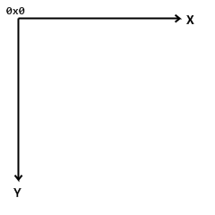
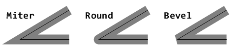
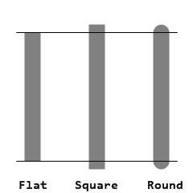
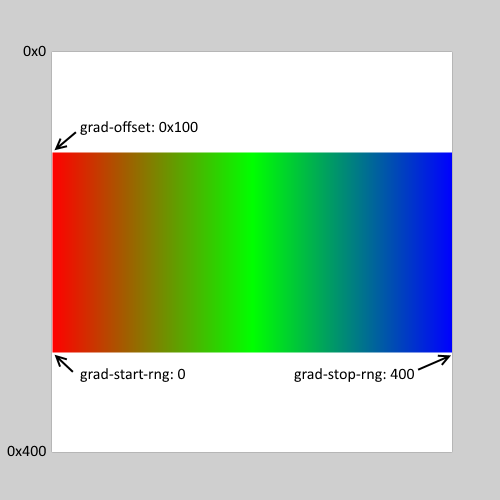

= Draw dialect
:imagesdir: ../images
:toc:
:toclevels: 3
:numbered:

== Abstract 

Draw is a dialect (DSL) of Red language that provides a simple declarative way to specify 2D drawing operations. Such operations are expressed as lists of ordered commands (using blocks of values), which can be freely constructed and changed at run-time.

Draw blocks can be rendered directly on top of an image using the `draw` function, or inside a View face using the `draw` facet (see link:view.html[View documentation]).

== Draw commands

Commands can either be drawing instructions or settings for the drawing instructions. When a mode is set, it will affect all subsequent operations in the current Draw session (or until changed).

Most Draw commands require coordinates to be specified. The 2D coordinate system used is:

* x axis: increasing from left to right of the display.
* y axis: increasing from top to bottom of the display.

Some drawing commands require lengths to be specified. The length required is number of pixels.

=== Line 

*Syntax*

----
line <point> <point> ...

<point> : coordinates of a point (pair!).
----
*Description*

Draws a line between two points. If more points are specified, additional lines are drawn, connecting each point in the provided order.

=== Triangle 

*Syntax*
----
triangle <point> <point> <point>

<point> : coordinates of a vertex of the triangle (pair!).
----
NOTE: A vertex is the point at which two lines meet. They are points where edges join.

*Description*

Draws a triangle with edges between the supplied vertices.

=== Box 

*Syntax*
----
box <top-left> <bottom-right>
box <top-left> <bottom-right> <corner>

<top-left>     : coordinates of the top-left of the box (pair!).
<bottom-right> : coordinates of the bottom-right of the box (pair!).
<corner>       : (optional) radius of the arc used to draw a round corner (integer!).
----
*Description*

Draws a box using the top-left (first argument) and bottom-right (second argument) vertices. An optional radius can be provided for making round corners.

=== Polygon 

*Syntax*
----
polygon <point> <point> ...

<point> : coordinates of a vertex (pair!).
----
*Description*

Draws a polygon using the provided vertices. The last point does not need to be the starting point, an extra line will be drawn anyway to close the polygon. Minimal number of points to be provided is 3.

=== Circle
 
*Syntax*
----
circle 
 <radius>
circle 
 <radius-x> <radius-y>

   : coordinates of the circle's center (pair!).
<radius>   : radius of the circle (integer! float!).
<radius-x> : (ellipse mode) radius of the circle along X axis (integer! float!).
<radius-y> : (ellipse mode) radius of the circle along Y axis (integer! float!).
----
*Description*

Draws a circle from the provided center and radius values. The circle can be distorted to form an ellipse by adding an optional integer indicating the radius along Y axis (the other radius argument then becomes the radius along X).

=== Ellipse 

*Syntax*
----
ellipse <top-left> <size>

<top-left> : coordinates of the ellipse's bounding box top-left point (pair!).
<size>     : size of the bounding box (pair!).
----
*Description*

Draws an ellipse from the specified bounding box. The `size` argument represents the X and Y diameters of the ellipse.

NOTE: `ellipse` provide a more compact and box-oriented way to specify a circle/ellipse compared to `circle` command.

=== Arc 

*Syntax*
----
arc 
 <radius> <begin> <sweep>
arc 
 <radius> <begin> <sweep> closed

 : coordinates of the circle's center (pair!).
<radius> : radius of the circle (pair!).
<begin>  : starting angle in degrees (integer!).
<sweep>  : angle between the starting and ending points of the arc in degrees (integer!).
----
*Description*

Draws the arc of a circle from the provided center and radius values. The arc is defined by two angles values. An optional `closed` keyword can be used to draw a closed arc using two lines coming from the center point.

=== Curve 

*Syntax*
----
curve <end-A> <control-A> <end-B>
curve <end-A> <control-A> <control-B> <end-B>

<end-A>     : end point A (pair!).
<control-A> : control point A (pair!).
<control-B> : control point B (pair!).
<end-B>     : end point B (pair!).
----
*Description*

Draws a Bezier curve from 3 or 4 points:

* 3 points: 2 end points, 1 control point.
* 4 points: 2 end points, 2 control points.

Four points allow more complex curves to be created.

=== Spline 

*Syntax*
----
spline <point> <point> ...
spline <point> <point> ... closed

<point> : a control point (pair!).
----
*Description*

Draws a B-Spline curve from a sequence of points. At least 3 points are required to produce a spline. The optional `closed` keyword will draw an extra segment from the end point to the start point, in order to close the spline.

NOTE: 2 points are accepted, but they will produce only a straight line.

=== Image 

*Syntax*
----
image <image>
image <image> <top-left>
image <image> <top-left> <bottom-right>
image <image> <top-left> <top-right> <bottom-left> <bottom-right>
image <image> <top-left> <top-right> <bottom-left> <bottom-right> <color>
image <image> <top-left> <top-right> <bottom-left> <bottom-right> <color> border
image <image> <top-left> <top-right> <bottom-left> <bottom-right> <color> crop <offset> <size>

<image>        : image to display (image! word!).
<top-left>     : (optional) coordinate of top left edge of the image (pair!).
<top-right>    : (optional) coordinate of top right edge of the image (pair!).
<bottom-left>  : (optional) coordinate of bottom left edge of the image (pair!).
<bottom-right> : (optional) coordinate of bottom right edge of the image (pair!).
<color>        : (optional) key color to be made transparent (tuple! word!).
<offset>       : (optional) position for starting cropping (pair!).
<size>         : (optional) size of cropping (pair!).
----
*Description*

Paints an image using the provided information for position and width. If the image has no positioning information provided, then the image is painted at 0x0 coordinates. A color value can be optionally provided, it will be used for transparency. 

NOTE:

* Four points mode is not yet implemented. It will allow to stretch the image using 4 arbitrary-positioned edges.
* `border` optional mode is not yet implemented.

=== Text 

*Syntax*
----
text <position> <string>

<position> : coordinates where the string is printed (pair!).
<string>   : text to print (string!).
----
*Description*

Prints a text string at the provided coordinates using the current font. 

NOTE: If no font is selected or if the font color is set to `none`, then the pen color is used instead.

=== Font 

*Syntax*
----
font 

 : new font object to use (object! word!).
----
*Description*

Selects the font to be used for text printing. The font object is a clone of `font!`.

=== Pen 

This command defines the outlines drawing mode for other commands. Many different options are available from a simple color, to nested custom shapes and gradients.

==== Color pen

*Syntax*
----
pen <color>

<color> : new color to use for drawing (tuple! word!).
----
*Description*

Selects the color to be used for drawing operations. All shapes will be drawn by the selected color until the pen is set to `off`.

==== Linear gradient pen

*Syntax*
----
pen linear <color1> <offset> ... <colorN> <offset> <start> <end> <spread>

<color1/N> : list of colors for the gradient (tuple! word!).
<offset>   : (optional) offset of gradient color (float!).
<start>    : (optional) starting point (pair!). 
<end>      : (optional unless <start>) ending point (pair!).
<spread>   : (optional) spread method (word!).
----
*Description*

Sets a linear gradient to be used for drawing operations. The following values are accepted for the spread method: `pad`, `repeat`, `reflect` (currently `pad` is same as `repeat` for Windows platform).

When used, the start/end points define a line where the gradient paints along. If they are not used,
the gradient will be paint along a horizontal line inside the shape currently drawing.

==== Radial gradient pen

*Syntax*
----
pen radial <color1> <offset> ... <colorN> <offset> 
 <radius> <focal> <spread>

<color1/N> : list of colors for the gradient (tuple! word!).
<offset>   : (optional) offset of gradient color (float!).

   : (optional) center point (pair!).
<radius>   : (optional unless 
) radius of the circle to paint along (integer! float!).
<focal>    : (optional) focal point (pair!).
<spread>   : (optional) spread method (word!).
----
*Description*

Sets a radial gradient to be used for drawing operations. The following values are accepted for the spread method: `pad`, `repeat`, `reflect` (currently `pad` is same as `repeat` for Windows platform).

The radial gradient will be painted from focal point to the edge of a circle defined by center point and radius. The start color will be painted in focal point and the end color will be painted in the edge of the circle.

==== Diamond gradient pen

*Syntax*
----
pen diamond <color1> <offset> ... <colorN> <offset> <upper> <lower> <focal> <spread>

<color1/N> : list of colors for the gradient (tuple! word!).
<offset>   : (optional) offset of gradient color (float!).
<upper>    : (optional) upper corner of a rectangle. (pair!). 
<lower>    : (optional unless <upper>) lower corner of a rectangle (pair!).
<focal>    : (optional) focal point (pair!).
<spread>   : (optional) spread method (word!).
----
*Description*

Sets a diamond-shaped gradient to be used for drawing operations. The following values are accepted for the spread method: `pad`, `repeat`, `reflect` (currently `pad` is same as `repeat` for Windows platform).

The diamond gradient will be painted from focal point to the edge of a rectangle defined by upper and lower. The start color will be painted in focal point and the end color will be painted in the edge of the circle.

==== Pattern pen

*Syntax*
----
pen pattern <size> <start> <end> <mode> [<commands>]

<size>     : size of the internal image where <commands> will be drawn (pair!).
<start>    : (optional) upper corner for crop section within internal image (pair!).
<end>      : (optional) lower corner for crop section within internal image (pair!).
<mode>     : (optional) tile mode (word!).
<commands> : block of Draw commands to define the pattern.
----
*Description*

Sets a custom shape as pattern to be used for drawing operations. The following values are accepted for the tile mode: `tile` (default), `flip-x`, `flip-y`, `flip-xy`, `clamp`.

Starting default point is 0x0 and ending point is `<size>`.

==== Bitmap pen

*Syntax*
----
pen bitmap  <image> <start> <end> <mode>

<image> : image used for tiling (image!).
<start> : (optional) upper corner for crop section within image (pair!).
<end>   : (optional) lower corner for crop section within image (pair!).
<mode>  : (optional) tile mode (word!).
----
*Description*

Sets an image as pattern to be used for drawing operations. The following values are accepted for the tile mode: `tile` (default), `flip-x`, `flip-y`, `flip-xy`, `clamp`.

Starting default point is 0x0 and ending point is image's size.

==== Turning off the pen

*Syntax*
----
pen off
----
*Description*

Stop all outline drawing operations for subsequent commands.

=== Fill-pen 

This command defines the filling mode for other commands requiring filling operations (closed shapes). Many different options are available from a simple color, to nested custom shapes and gradients.

==== Color fill

*Syntax*
----
fill-pen <color>

<color> : new color to use for filling (tuple! word!).
----
*Description*

Selects the color to be used for filling operations. All closed shapes will get filled by the selected color until the fill pen is set to `off`.

==== Linear gradient fill

*Syntax*
----
fill-pen linear <color1> <offset> ... <colorN> <offset> <start> <end> <spread>

<color1/N> : list of colors for the gradient (tuple! word!).
<offset>   : (optional) offset of gradient color (float!).
<start>    : (optional) starting point (pair!). 
<end>      : (optional unless <start>) ending point (pair!).
<spread>   : (optional) spread method (word!).
----
*Description*

Sets a linear gradient to be used for filling operations. The following values are accepted for the spread method: `pad`, `repeat`, `reflect` (currently `pad` is same as `repeat` for Windows platform).

When used, the start/end points define a line where the gradient paints along. If they are not used,
the gradient will be paint along a horizontal line inside the shape currently drawing.

==== Radial gradient fill

*Syntax*
----
fill-pen radial <color1> <offset> ... <colorN> <offset> 
 <radius> <focal> <spread>

<color1/N> : list of colors for the gradient (tuple! word!).
<offset>   : (optional) offset of gradient color (float!).

   : (optional) center point (pair!).
<radius>   : (optional unless 
) radius of the circle to paint along (integer! float!).
<focal>    : (optional) focal point (pair!).
<spread>   : (optional) spread method (word!).
----
*Description*

Sets a radial gradient to be used for filling operations. The following values are accepted for the spread method: `pad`, `repeat`, `reflect` (currently `pad` is same as `repeat` for Windows platform).

The radial gradient will be painted from focal point to the edge of a circle defined by center point and radius. The start color will be painted in focal point and the end color will be painted in the edge of the circle.

==== Diamond gradient fill

*Syntax*
----
fill-pen diamond <color1> <offset> ... <colorN> <offset> <upper> <lower> <focal> <spread>

<color1/N> : list of colors for the gradient (tuple! word!).
<offset>   : (optional) offset of gradient color (float!).
<upper>    : (optional) upper corner of a rectangle. (pair!). 
<lower>    : (optional unless <upper>) lower corner of a rectangle (pair!).
<focal>    : (optional) focal point (pair!).
<spread>   : (optional) spread method (word!).
----
*Description*

Sets a diamond-shaped gradient to be used for filling operations. The following values are accepted for the spread method: `pad`, `repeat`, `reflect` (currently `pad` is same as `repeat` for Windows platform).

The diamond gradient will be painted from focal point to the edge of a rectangle defined by upper and lower. The start color will be painted in focal point and the end color will be painted in the edge of the circle.

==== Pattern fill

*Syntax*
----
fill-pen pattern <size> <start> <end> <mode> [<commands>]

<size>     : size of the internal image where <commands> will be drawn (pair!).
<start>    : (optional) upper corner for crop section within internal image (pair!).
<end>      : (optional) lower corner for crop section within internal image (pair!).
<mode>     : (optional) tile mode (word!).
<commands> : block of Draw commands to define the pattern.
----
*Description*

Sets a custom shape as pattern to be used for filling operations. The following values are accepted for the tile mode: `tile` (default), `flip-x`, `flip-y`, `flip-xy`, `clamp`.

Starting default point is 0x0 and ending point is `<size>`.

==== Bitmap fill

*Syntax*
----
fill-pen bitmap  <image> <start> <end> <mode>

<image> : image used for tiling (image!).
<start> : (optional) upper corner for crop section within image (pair!).
<end>   : (optional) lower corner for crop section within image (pair!).
<mode>  : (optional) tile mode (word!).
----
*Description*

Sets an image as pattern to be used for filling operations. The following values are accepted for the tile mode: `tile` (default), `flip-x`, `flip-y`, `flip-xy`, `clamp`.

Starting default point is 0x0 and ending point is image's size.

==== Turning off the filling

*Syntax*
----
fill-pen off
----
*Description*

Stop all filling operations for subsequent commands.

=== Line-width 

*Syntax*
----
line-width <value>

<value> : new line width in pixels (integer!).
----
*Description*

Sets the new width for line operations.

=== Line-join 

*Syntax*
----
line-join <mode>

<mode> : new line joining mode (word!).
----
*Description*

Sets the new line joining mode for line operations. Following values are accepted:

* `miter` (default)
* `round`
* `bevel`
* `miter-bevel`

NOTE: `miter-bevel` mode selects automatically one or the other joining mode depending on the miter length (See https://msdn.microsoft.com/en-us/library/windows/desktop/ms534148%28v=vs.85%29.aspx[this page] for detailed explanation) .

=== Line-cap 

*Syntax*
----
line-cap <mode>

<mode> : new line cap mode (word!).
----
*Description*

Sets the new line's ending cap mode for line operations. Following values are accepted:

* `flat` (default)
* `square`
* `round`

=== Anti-alias 

*Syntax*
----
anti-alias <mode>

<mode> : `on` to enable it or `off` to disable it.
----
*Description*

Turns on/off the anti-aliasing mode for following Draw commands.

NOTE: Anti-aliasing gives nicer visual rendering, but degrades performance.

=== Matrix 

*Syntax*
----
matrix <matrix-setup>
matrix 'pen <matrix-setup>
matrix 'fill-pen <matrix-setup>

<matrix-setup> : the matrix which is pre/post-multiplied to current matrix (block!).
----
*Description*

Performs matrix multiplication. The current transformation matrix is pre-multiplied by this matrix.

The `matrix-setup` block must have 6 numbers (number!) in it. 
----
matrix [a b c d e f]
----
The block values are used internally for building following transformation matrix:
----
|a c e|
|b d f|
|0 0 1|
----

When the `'pen` or `'fill-pen` lit-words are used, the multiplication is applied respectively to the current pen or current fill-pen.

=== Matrix-order

*Syntax*
----
matrix-order <mode>

<mode> : 'append or 'prepend (word!).
----
*Description*

Defines if new matrices in subsequent matrix operations, are pre-multiplied (`prepend`, default mode) or post-multiplied (`append`) to the current matrix.

=== Reset-matrix 

*Syntax*
----
reset-matrix
reset-matrix 'pen
reset-matrix 'fill-pen
----
*Description*

Resets the current transformation matrix to a unit matrix.

When the `'pen` or `'fill-pen` lit-words are used, the reset is applied respectively to the current pen or current fill-pen.

----
|1 0 0|
|0 1 0|
|0 0 1|
----

=== Invert-matrix 

*Syntax*
----
invert-matrix
invert-matrix 'pen
invert-matrix 'fill-pen
----
*Description*

Applies an algebraic matrix inversion operation on the current transformation matrix.

When the `'pen` or `'fill-pen` lit-words are used, the inversion is applied respectively to the current pen or current fill-pen.

=== Push 

*Syntax*
----
push <draw-block>

<draw-block> : block of Draw commands (block!).
----
*Description*

Saves the current state (transformations, clipping region, and pen settings) on the stack. You can then change the current transformation matrix, pens etc. inside the PUSH command block. After the PUSH command block, the current state is restored by pop from the stack. The PUSH command can be nested.

=== Rotate 

*Syntax*
----
rotate <angle> 
 [<commands>]
rotate 'pen <angle>
rotate 'fill-pen <angle>

<angle>    : the angle in degrees (integer! float!).

   : (optional) center of rotation (pair!).
<commands> : (optional) Draw dialect commands.
----
*Description*

Sets the clockwise rotation about a given point, in degrees. If optional `center` is not supplied, the rotate is about the origin of the current user coordinate system. Negative numbers can be used for counter-clockwise rotation. When a block is provided as last argument, the rotation will be applied only to the commands in that block.

When the `'pen` or `'fill-pen` lit-words are used, the rotation is applied respectively to the current pen or current fill-pen.

=== Scale 

*Syntax*
----
scale <scale-x> <scale-y> [<commands>]
scale 'pen <scale-x> <scale-y>
scale 'fill-pen <scale-x> <scale-y>

<scale-x>  : the scale amount in X (number!).
<scale-y>  : the scale amount in Y (number!).
<commands> : (optional) Draw dialect commands.
----
*Description*

Sets the scale amounts. The values given are multipliers; use values greater than one to increase the scale; use values less than one to decrease it. When a block is provided as last argument, the scaling will be applied only to the commands in that block.

When the `'pen` or `'fill-pen` lit-words are used, the scaling is applied respectively to the current pen or current fill-pen.

=== Translate 

*Syntax*
----
translate <offset> [<commands>]
translate 'pen <offset>
translate 'fill-pen <offset>

<offset>   : the translation amounts (pair!).
<commands> : (optional) Draw dialect commands.
----
*Description*

Sets the origin for drawing commands. Multiple translate commands will have a cumulative effect. When a block is provided as last argument, the translation will be applied only to the commands in that block.

When the `'pen` or `'fill-pen` lit-words are used, the translation is applied respectively to the current pen or current fill-pen.

=== Skew 

*Syntax*
----
skew <skew-x> <skew-y> [<commands>]
skew 'pen <skew-x> <skew-y>
skew 'fill-pen <skew-x> <skew-y>

<skew-x>   : skew along the x-axis in degrees (integer! float!).
<skew-y>   : (optional) skew along the y-axis in degrees (integer! float!).
<commands> : (optional) Draw dialect commands.
----
*Description*

Sets a coordinate system skewed from the original by the given number of degrees. If `<skew-y>` is not provided, it is assumed to be zero. When a block is provided as last argument, the skewing will be applied only to the commands in that block.

When the `'pen` or `'fill-pen` lit-words are used, the skewing is applied respectively to the current pen or current fill-pen.

=== Transform 

*Syntax*
----
transform <angle> 
 <scale-x> <scale-y> <translation> [<commands>]
transform 'pen <angle> 
 <scale-x> <scale-y> <translation>
transform 'fill-pen <angle> 
 <scale-x> <scale-y> <translation>

<angle>       : the rotation angle in degrees (integer! float!).

      : (optional) center of rotation (pair!).
<scale-x>     : the scale amount in X (number!).
<scale-y>     : the scale amount in Y (number!).
<translation> : the translation amounts (pair!).
<commands>    : (optional) Draw dialect commands.
----
*Description*

Sets a transformation such as translation, scaling, and rotation. When a block is provided as last argument, the transformation will be applied only to the commands in that block.

When the `'pen` or `'fill-pen` lit-words are used, the transformation is applied respectively to the current pen or current fill-pen.

=== Clip

*Syntax*
----
clip <start> <end> <mode> [<commands>]
clip [<shape>] <mode> [<commands>]

<start>    : top-left corner point of clipping area (pair!)
<end>      : bottom-right corner point of clipping area (pair!)
<mode>     : (optional) merging mode between clipped regions (word!)
<commands> : (optional) Draw dialect commands.
<shape>    : Shape dialect commands.
----
*Description*

Defines a clipping rectangular region defined with two points (start and end) or an arbitrarily shaped region defined by a block of Shape sub-dialect commands. Such clipping applies to all subsequent Draw commands. When a block is provided as last argument, the clipping will be applied only to the commands in that block.

Additionally, the combining mode between a new clipping region and the previous one, can be set to one of the following:

* `replace` (default)
* `intersect`
* `union`
* `xor`
* `exclude`

== Shape commands

*Syntax*
----
shape [<commands>]

<commands> : shape dialect commands.
----
*Description*

The `shape` keywords gives access to the Shape sub-dialect drawing commands. The specific features of this drawing dialect are: 

* the pen position for drawing can be moved independently of drawing operations.
* each drawing command starts from the current pen position.
* shapes are automatically closed (no need to draw the last stroke back to start position).
* the generated shapes can be fed to `fill-pen` for simple or sophisticated filling.
* coordinates can be absolute (like in Draw) or relative to the last pen position.

NOTE: All drawing commands are using absolute coordinates by default, using the lit-word version of the command switches the command to relative coordinates.

=== Move

*Syntax*
----
 move <position>            (absolute)
'move <position>            (relative)

<position> : new pen position (pair!).
----
*Description*

Moves the pen to a new position. No drawing happens.

=== Line

*Syntax*
----
 line <point> <point> ...   (absolute)
'line <point> <point> ...   (relative)

<point> : coordinates of a point (pair!).
----
*Description*

Draws a line between two points. If more points are specified, additional lines are drawn, connecting each point in the provided order.

=== Arc

*Syntax*
----
 arc <end> <radius-x> <radius-y> <angle> sweep closed       (absolute)
'arc <end> <radius-x> <radius-y> <angle> sweep closed       (relative)

<end>      : arc's end point (pair!).
<radius-x> : radius of the circle along x axis (integer! float!).
<radius-y> : x coordinate of radius of the circle (integer! float!).
<angle>    : angle between the starting and ending points of the arc in degrees (integer! float!).
sweep      : (optional) draw the arc in the positive angle direction.
large      : (optional) produces an inflated arc (goes with 'sweep option).

----
*Description*

Draws the arc of a circle between the current pen position and the end point, using radius values. The arc is defined by one angle value.

=== Curve

*Syntax*
----
 curve <point> <point> <point> ...   (absolute)
'curve <point> <point> <point> ...   (relative)

<point> : coordinates of a point (pair!).
----
*Description*

Draws a cubic Bezier curve from a sequence of points, starting from the current pen position. At least 3 points are required to produce a curve (the first point is the implicit starting point).

=== Curv

*Syntax*
----
 curv <point> <point> ...   (absolute)
'curv <point> <point> ...   (relative)

<point> : coordinates of a point (pair!).
----
*Description*

Draws a smooth cubic Bezier curve from a sequence of points, starting from the current pen position. At least 2 points are required to produce a curve (the first point is the implicit starting point).

NOTE: From http://www.w3.org/TR/SVG11/paths.html

"The first control point is assumed to be the reflection of the second control point on the previous command relative to the current point. (If there is no previous curve command, the first control point is the current point.)"

=== Qcurve

*Syntax*
----
 qcurve <point> <point> ...   (absolute)
'qcurve <point> <point> ...   (relative)

<point> : coordinates of a point (pair!).
----
*Description*

Draws a quadratic Bezier curve from a sequence of points, starting from the current pen position. At least 2 points are required to produce a curve (the first point is the implicit starting point).

=== Qcurv

*Syntax*
----
 qcurv <point>   (absolute)
'qcurv <point>   (relative)

<point> : coordinates of the ending point (pair!).
----
*Description*

Draws a smooth quadratic Bezier curve from the current pen position to the specified point.

NOTE: See See: http://www.w3.org/TR/SVG11/paths.html

=== Hline

*Syntax*
----
 hline <end-x>   (absolute)
'hline <length>  (relative)

<end-x>  : ending position along X axis (integer! float!).
<length> : length of the line segment (integer! float!).
----
*Description*

Draws a horizontal line from the current pen position.

=== Vline

*Syntax*
----
 vline <end-y>   (absolute)
'vline <length>  (relative)

<end-y>  : ending position along Y axis (integer! float!).
<length> : length of the line segment (integer! float!).
----
*Description*

Draws a vertical line from the current pen position.

=== Line-width

Same as the Draw dialect.

=== Line-join

Same as the Draw dialect.

=== Line-cap

Same as the Draw dialect.

=== Pen

Same as the Draw dialect.

=== Fill-pen

Same as the Draw dialect.

== Default values 

When a new Draw session starts, the following default values are used:

[cols="2,3", options="header"]
|===
|Property | Value

|background | `white`
|pen color |  `black`
|filling|    `off`
|anti-alias|	 `on`
|font|	 `none`
|line width|	 `1`
|line join|	 `miter`
|line cap| `flat`
|===

== Sub blocks 

Inside Draw code, commands can be arbitrarily grouped using blocks. Semantics remain unchanged, this is currently just a syntactic sugar allowing easier group manipulations of commands (notably group extraction/insertion/removal). Empty blocks are accepted.

== Source position 

Set-words can be used in the Draw code *in-between* commands to record the current position in Draw block and be able to easily access it later.

NOTE: If the Draw block length preceeding a set-word is changed, the recorded position will not be updated.

== Draw function 

It is possible to render a Draw block directly to an image using the `draw` function.

*Syntax*
----
draw <size> <spec>
draw <image> <spec>

<size>  : size of a new image (pair!).
<image> : image to use as canvas (image!).
<spec>  : block of Draw commands (block!).
----
*Description*

Renders the provided Draw commands to an existing or a new image. The image value is returned by the function.

== Deprecated API

Fill-pen also supports a deprecated API which exists only for sake of compatibility with Rebol/Draw, it should not be used by new Red scripts.

*Syntax*
----
fill-pen linear <grad-offset> <grad-start-rng> <grad-stop-rng>
         <grad-angle> <grad-scale-x> <grad-scale-y> <grad-color> <offset>
         <grad-color> <offset> ...

fill-pen radial <grad-offset> <grad-focal> <grad-radius>
         <grad-angle> <grad-scale-x> <grad-scale-y> <grad-color> <offset>
         <grad-color> <offset> ...

fill-pen diamond <grad-offset> <grad-focal> <grad-radius>
         <grad-angle> <grad-scale-x> <grad-scale-y> <grad-color> <offset>
         <grad-color> <offset> ...

<grad-type>      : gradient type (word!).
<grad-offset>    : offset from where should the gradient be rendered (pair!).
<grad-start-rng> : beginning of the gradient range (integer!).
<grad-stop-rng>  : end of the gradient range (integer!).
<grad-focal>     : focal point of the gradient (pair!).
<grad-radius>    : radius of the gradient (integer!).
<grad-angle>     : (optional) rotation of the gradient in degrees (integer! float!).
<grad-scale-x>   : (optional) scale X factor (integer! float!).
<grad-scale-y>   : (optional) scale Y factor (integer! float!).
<grad-color>     : color to use for gradient filling (tuple! word!).
----
*Description*

Sets the color gradient to be used for filling operations. The following values are accepted for the type: `linear`, `radial`, `diamond`.

For example:

	fill-pen linear 0x100 0 400 red green blue box 0x100 400x300

NOTE: the gradient can be defined by up to 256 colors.

== Graphics source code 

The graphics in this documentation are generated using Red and Draw dialect, here is the source code (you can copy/paste it in a Red console to try/play/improve it):
----
Red [
	Title:	"Graphics generator for Draw documentation"
	Author: "Nenad Rakocevic"
	File:   %draw-graphics.red
	Needs:	View
]

Arial: make font! [name: "Consolas" style: 'bold]
small: make font! [size: 9 name: "Consolas" style: 'bold]

save %line-cap.png draw 240x240 [
	font Arial
	text 20x220  "Flat"
	text 90x220  "Square"
	text 180x220 "Round"

	line-width 20 pen gray
	line-cap flat	line 40x40  40x200
	line-cap square line 120x40 120x200
	line-cap round	line 200x40 200x200

	line-width 1 pen black
	line 20x40  220x40
	line 20x200 220x200
]

save %line-join.png draw 500x100 [
	font Arial
	text 10x20  "Miter"
	text 170x20 "Round"
	text 330x20 "Bevel"

	line-width 20 pen gray
	line-join miter line 140x20 40x80  140x80
	line-join round line 300x20 200x80 300x80
	line-join bevel line 460x20 360x80 460x80

	line-join miter
	line-width 1 pen black
	line 140x20 40x80  140x80
	line 300x20 200x80 300x80
	line 460x20 360x80 460x80
]

save %coord-system.png draw 240x240 [
	font small
	text 5x5 "0x0"
	line-width 2
	line 20x20 200x20 195x16
	line 200x20 195x24

	line 20x20 20x200 16x195
	line 20x200 24x195

	font Arial
	text 205x12 "X"
	text 12x205 "Y"
]

save %grad-pen.png draw 400x400 [
	pen off
	fill-pen linear 0x100 0 400 red green blue box 0x100 400x300
]

save %grad-pen-more.png draw 600x400 [
	pen off
	fill-pen linear 0x0 0 200 red green blue box 0x0 200x200
	fill-pen linear 200x0 0 200 255.0.0 255.255.0 0.255.0 0.255.255 0.0.255 box 200x0 400x200
	fill-pen linear 400x0 0 200 255.0.0 0.1 255.255.0 0.2 0.255.0 0.4 0.255.255 0.8 0.0.255 .9 255.0.255 1.0 box 400x0 600x200
	fill-pen blue box 0x200 200x400 fill-pen radial 100x300 0 100 255.0.0 0.255.0 0.0.255 box 0x200 200x400
	fill-pen blue box 200x200 400x400 fill-pen diamond 300x300 0 100 30 255.0.0 0.255.0 0.0.255 box 200x200 400x400
	fill-pen diamond 500x300 0 100 30 3.0 1.5 255.0.0 0.255.0 0.0.255 box 400x200 600x400
]
----