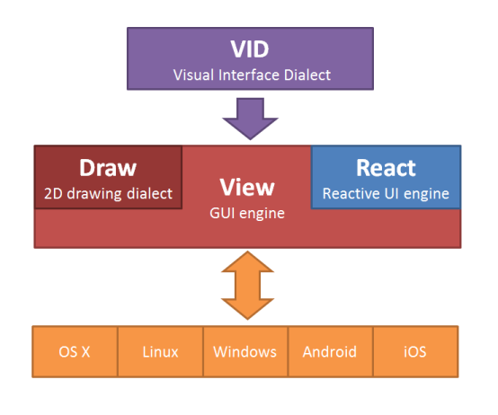

== Red GUI Architecture ==

=== VID 

VID stands for Visual Interface Dialect. It is a dialect of Red, providing the simplest possible way to specify graphic components with their properties, layouts and even event handlers. VID code is compiled at runtime to a tree of faces suitable for displaying.

=== View 
 
The GUI code engine contains several parts:

* Platform-independent faces management engine
* Reactive actions events
* Draw dialect interpreter
* Platform-specific backends

=== React

Reactive actions can be defined directly from VID dialect or can be specified directly using the REACT function.

=== Draw

Draw is a Red dialect for 2D vector drawing. It can be specified in different ways:

* in VID layouts
* directly in the `draw` property of any face object
* using the DRAW function to draw directly onto an image

=== Platform-specific backends

An internal API allows multiple backends (OS/graphic system combinations) so that the View engine can be implemented in different environments. Each backend must be capable of extensive 2D drawing for complete support of Draw dialect.

.Disclaimer

The initial design of VID, Draw and most of View (except for the reactive parts) were created by Carl Sassenrath and implemented in Rebol. Red View is a completely new, independent implementation providing similar features with some desirable improvements. Reactive actions being a prime example.