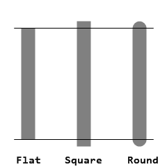

= Le dialecte Draw
:imagesdir: ../images
:toc:
:toclevels: 3
:numbered:

== Résumé 

Draw est un dialecte (DSL) du langage Red qui offre une manière déclarative simple de spécifier des opérations de dessin 2D. De telles opérations sont exprimées comme des listes de commandes ordonnées (en utilisant des blocs de valeurs), qui peuvent être librement construits et transformés à l'exécution.

Les blocs de Draw peuvent être restitués directement sur une image en utilisant la fonction `draw`, ou à l'intérieur d'une figure de View en utilisant la facette `draw` (voir la link:view.adoc[documentation de View]).

== Commandes de Draw (dessin)

Les commandes peuvent être soit des instructions de dessin soit des paramètres pour ces instructions. Lorsqu'un mode est défini, celui-ci affectera toutes les opérations suivantes dans la session de Draw en cours (ou jusqu'au prochain changement).

La plupart des commandes de Draw requièrent que des coordonnées soient spécifiées. Le système de coordonnées 2D utilisé est:

* axe des X : croissant de la gauche vers la droite de l'écran.
* axe des Y : croissant du haut vers le bas de l'écran.

Certaines commandes de dessin requièrent la spécification d'une longueur. La longueur requise est un nombre de pixels.

image::../images/coord-system.png[Coord-system,align="center"]

=== Line (ligne)

*Syntaxe*

----
line <point> <point> ...

<point> : coordonnées d'un point (pair!).
----

*Description*

Trace une ligne entre deux points. Si plus de points sont spécifiés, des lignes supplémentaires sont tracées, joignant les points dans l'ordre donné.

=== Triangle 

*Syntaxe*

----
triangle <point> <point> <point>

<point> : coordonnées d'un sommet du triangle (pair!).
----

NOTE: Un sommet est le point auquel deux lignes se rejoignent. Ce sont les points où les côtés se touchent. 

*Description*

Trace un triangle dont les côtés joignent les sommets donnés.

=== Box (rectangle)

*Syntaxe*

----
box <top-left> <bottom-right>
box <top-left> <bottom-right> <corner>

<top-left>     : coordonnées du sommet en haut à gauche du rectangle (pair!).
<bottom-right> : coordonnées du sommet en bas à droite du rectangle (pair!).
<corner>       : (optionnel) rayon de l'arc utilisé pour arrondir les angles (integer!).
----

*Description*

Trace un rectangle dont les sommets en haut à gauche et en bas à droite sont donnés. Un rayon optionnel peut être donné pour arrondir les angles.

=== Polygon 

*Syntaxe*

----
polygon <point> <point> ...

<point> : coordonnées d'un sommet (pair!).
----

*Description*

Dessine un polygone à partir des sommets donnés. Le dernier point n'a pas besoin d'être le point de départ, une ligne supplémentaire sera tracée de toute façon pour fermer le polygone. Au moins 3 points doivent être fournis.

=== Circle (cercle)
 
*Syntaxe*

----
circle 
 <radius>
circle 
 <radius-x> <radius-y>

   : coordonnées du centre du cercle (pair!).
<radius>   : rayon du cercle (integer! float!).
<radius-x> : (mode ellipse) rayon de l'ellipse suivant l'axe des X (integer! float!).
<radius-y> : (mode ellipse) rayon de l'ellipse suivant l'axe des Y (integer! float!).
----

*Description*

Trace un cercle à partir des valeurs de centre et de rayon fournies. Le cercle peut être déformé en une ellipse en ajoutant un entier optionnel, indiquant le rayon suivant l'axe des Y (l'autre argument de rayon devient alors le rayon suivant l'axe des X).

=== Ellipse 

*Syntaxe*

----
ellipse <top-left> <size>

<top-left> : coordonnées du point en haut à gauche du rectangle circonscrit à l'ellipse (pair!).
<size>     : taille du rectangle circonscrit (pair!).
----

*Description*

Trace un ellipse inscrite dans le rectangle spécifié. L'argument `size` représente les diamètres de l'ellipse dans les dimensions X et Y.

NOTE: `ellipse` fournit une méthode compacte et plus orientée-rectangle que la commande `circle` pour spécifier un cercle/une ellipse.

=== Arc 

*Syntaxe*

----
arc 
 <radius> <begin> <sweep>
arc 
 <radius> <begin> <sweep> closed

 : coordonnées du centre du cercle (pair!).
<radius> : rayon du cercle (pair!).
<begin>  : angle de départ en degrés (integer!).
<sweep>  : angle entre les points de début et de fin de l'arc, en degrés (integer!).
----

*Description*

Trace un arc de cercle à partir des valeurs de centre et de rayon données. L'arc est défini par deux valeurs d'angle. Un mot-clé optionnel `closed` peut être utilisé pour dessiner un arc fermé en ajoutant deux lignes venant du point-centre.

=== Curve (courbe de Bézier)

*Syntaxe*

----
curve <end-A> <control-A> <end-B>
curve <end-A> <control-A> <control-B> <end-B>

<end-A>     : extrémité A (pair!).
<control-A> : point de contrôle A (pair!).
<control-B> : point de contrôle B (pair!).
<end-B>     : extrémité B (pair!).
----

*Description*

Trace une courbe de Bézier à partir de 3 ou 4 points:

* 3 points: 2 extrémités, 1 point de contrôle.
* 4 points: 2 extrémités, 2 points de contrôle.

Quatre points permettent la création de courbes plus complexes.

=== Spline (courbe spline)

*Syntaxe*

----
spline <point> <point> ...
spline <point> <point> ... closed

<point> : un point de contrôle (pair!).
----

*Description*

Trace une courbe B-Spline à partir d'une séquence de points. Au moins 3 points sont nécessaires pour produire une courbe spline. Le mot-clé optionnel `closed` tracera un segment supplémentaire du dernier au premier point, afin de fermer la courbe.

NOTE: 2 points sont acceptés, mais ils ne produiront qu'une ligne droite.

=== Image 

*Syntaxe*

----
image <image>
image <image> <top-left>
image <image> <top-left> <bottom-right>
image <image> <top-left> <top-right> <bottom-left> <bottom-right>
image <image> <top-left> <top-right> <bottom-left> <bottom-right> <color>
image <image> <top-left> <top-right> <bottom-left> <bottom-right> <color> border
image <image> <top-left> <top-right> <bottom-left> <bottom-right> <color> crop <offset> <size>

<image>        : image à afficher (image! word!).
<top-left>     : (optionnel) coordonnées du coin supérieur gauche de l'image (pair!).
<top-right>    : (optionnel) coordonnées of du coin supérieur droit de l'image (pair!).
<bottom-left>  : (optionnel) coordonnées du coin inférieur gauche de l'image (pair!).
<bottom-right> : (optionnel) coordonnées du coin inférieur droit de l'image (pair!).
<color>        : (optionnel) couleur clé devant être rendue transparente (tuple! word!).
<offset>       : (optionnel) position de début du recadrage (pair!).
<size>         : (optionnel) taille du recadrage (pair!).
----

*Description*

Affiche une image en utilisant les informations de position et de taille spécifiées. Si aucune information de positionnement n'est fournie, alors l'image est positionnée aux coordonnées 0x0. Une valeur de couleur peut optionnellement être fournie, qui sera utilisée pour la transparence. 

[NOTE]
====
* Le mode à quatre points n'est pas encore implémenté. Il permettra d'étirer l'image en utilisant 4 coins positionnés arbitrairement.
* Le mode optionnel `border` n'est pas encore implémenté. Il est peu probable que cette fonctionnalité soit supportée.
* Vous ne pouvez pas utiliser des chemins pour spécifier des images. Le traitement des chemins est coûteux, c'est donc un mauvais choix pour le dialecte `draw` qui est optimisé pour les performances. Utilisez plutôt l'évaluation sélective (`compose`).
====

=== Text (texte)

*Syntaxe*

----
text <position> <string>

<position> : coordonnées auxquelles le texte est affiché (pair!).
<string>   : texte à afficher (string!).
----

*Description*

Affiche une chaîne de texte aux coordonnées données en utilisant la police courante. 

NOTE: si aucune police n'est définie ou si la couleur de police est définie à `none`, alors c'est la couleur de trait qui est utilisée.

=== Font (police)

*Syntaxe*

----
font 

 : nouvel objet de type font à utiliser (object! word!).
----

*Description*

Sélectionne la police à utiliser pour l'affichage de texte. L'objet font est un clone de `font!`.

=== Pen (trait)

Cette commande définit le mode de dessin des contours pour les autres commandes. De nombreuses options différentes sont disponibles, de la simple couleur à des formes et gradients personnalisés et imbriqués.

==== Couleur du trait

*Syntaxe*

----
pen <color>

<color> : nouvelle couleur à utiliser pour le dessin (tuple! word!).
----

*Description*

Sélectionne la couleur à utiliser pour les opérations de dessin. Toutes les formes seront dessinées dans la couleur spécifiée jusqu'à ce que le trait soit mis à `off`.

==== Trait à gradient linéaire

*Syntaxe*

----
pen linear <color1> <offset> ... <colorN> <offset> <start> <end> <spread>

<color1/N> : liste de couleurs pour le gradient (tuple! word!).
<offset>   : (optionnel) variation de la couleur du gradient (float!).
<start>    : (optionnel) point de début (pair!). 
<end>      : (optionnel sauf s'il y a <start>) point de fin (pair!).
<spread>   : (optionnel) méthode de diffusion (word!).
----

*Description*

Définit un gradient linéaire à utiliser pour les opérations de dessin. Les valeurs suivantes sont acceptées pour la méthode de diffusion: `pad`, `repeat`, `reflect` (actuellement `pad` est identique à `repeat` sur la plateforme Windows).

Lorsqu'ils sont utilisés, les points de début/de fin définissent une ligne le long de laquelle le gradient est appliqué. S'ils ne sont pas utilisés, le gradient s'appliquera selon une ligne horizontale à l'intérieur de la forme en cours de dessin.

==== Trait à gradient radial

*Syntaxe*

----
pen radial <color1> <offset> ... <colorN> <offset> 
 <radius> <focal> <spread>

<color1/N> : liste de couleurs pour le gradient (tuple! word!).
<offset>   : (optionnel) variation de la couleur du gradient (float!).

   : (optionnel) point central (pair!).
<radius>   : (optionnel sauf s'il y a 
) rayon du cercle le long duquel appliquer le gradient (integer! float!).
<focal>    : (optionnel) point focal (pair!).
<spread>   : (optionnel) méthode de diffusion (word!).
----

*Description*

Définit un gradient radial à utiliser pour les opérations de dessin. Les valeurs suivantes sont acceptées pour la méthode de diffusion: `pad`, `repeat`, `reflect` (actuellement `pad` est identique à `repeat` sur la plateforme Windows).

Le gradient radial sera appliqué depuis le point focal jusqu'au bord d'un cercle défini par le point central et le rayon. La couleur de départ sera appliquée au point focal et la couleur finale sera appliquée au bord du cercle.

==== Trait à gradient en diamant

*Syntaxe*

----
pen diamond <color1> <offset> ... <colorN> <offset> <upper> <lower> <focal> <spread>

<color1/N> : liste de couleurs pour le gradient (tuple! word!).
<offset>   : (optionnel) variation de la couleur du gradient (float!).
<upper>    : (optionnel) coin supérieur d'un rectangle (pair!). 
<lower>    : (optionnel sauf s'il y a <upper>) coin inférieur d'un rectangle (pair!).
<focal>    : (optionnel) point focal (pair!).
<spread>   : (optionnel) méthode de diffusion (word!).
----

*Description*

Définit un gradient en forme de diamant à utiliser pour les opérations de dessin. Les valeurs suivantes sont acceptées pour la méthode de diffusion: `pad`, `repeat`, `reflect` (actuellement `pad` est identique à `repeat` sur la plateforme Windows).

Le gradient en forme de diamant sera appliqué depuis le point focal jusqu'au bord d'un rectangle défini par les coins supérieur et inférieur. La couleur de départ sera appliquée au point focal et la couleur finale sera appliquée aux bords du diamant.

==== Trait à motif

*Syntaxe*

----
pen pattern <size> <start> <end> <mode> [<commands>]

<size>     : taille de l'image intérieure sur laquelle les <commands> seront dessinées (pair!).
<start>    : (optionnel) coin supérieur de la section recadrée dans l'image interne (pair!).
<end>      : (optionnel) coin inférieur de la section recadrée dans l'image interne (pair!).
<mode>     : (optionnel) mode de juxtaposition (word!).
<commands> : bloc de commandes Draw pour définir le motif.
----

*Description*

Définit une forme personnalisée comme motif pour les opérations de dessin. Les valeurs suivantes sont acceptées pour le mode de juxtaposition: `tile` (défaut), `flip-x`, `flip-y`, `flip-xy`, `clamp`.

Par défaut le point de début est 0x0 et le point de fin est `<size>`.

==== Trait à bitmap

*Syntaxe*

----
pen bitmap  <image> <start> <end> <mode>

<image> : image utilisée pour le dessin (image!).
<start> : (optionnel) coin supérieur de la section recadrée dans l'image (pair!).
<end>   : (optionnel) coin inférieur de la section recadrée dans l'image (pair!).
<mode>  : (optionnel) mode de juxtaposition (word!).
----

*Description*

Définit une image comme motif à utiliser pour les opérations de dessin. Les valeurs suivantes sont acceptées pour le mode de juxtaposition: `tile` (défaut), `flip-x`, `flip-y`, `flip-xy`, `clamp`.

Par défaut le point de début est 0x0 et le point de fin est la taille de l'image.

==== Arrêt du trait

*Syntaxe*

----
pen off
----

*Description*

Arrête toutes les opérations de dessin des contours pour les commandes qui suivent.

=== Fill-pen (remplissage)

Cette commande définit le mode de remplissage pour les autres commandes qui requièrent des opérations de remplissage (formes fermées). De nombreuses options différentes sont disponibles, de la simple couleur à des formes et gradients personnalisés et imbriqués.

==== Couleur de remplissage

*Syntaxe*

----
fill-pen <color>

<color> : nouvelle couleur à utiliser pour le remplissage (tuple! word!).
----

*Description*

Sélectionne la couleur à utiliser pour les opérations de remplissage. Toutes les formes fermées seront remplies par la couleur sélectionnée jusqu'à ce que le trait soit mis à `off`.

==== Remplissage à gradient linéaire

*Syntaxe*

----
fill-pen linear <color1> <offset> ... <colorN> <offset> <start> <end> <spread>

<color1/N> : liste des couleurs pour le gradient (tuple! word!).
<offset>   : (optionnel) variation de la couleur de gradient (float!).
<start>    : (optionnel) point de début (pair!). 
<end>      : (optionnel sauf s'il y a <start>) point de fin (pair!).
<spread>   : (optionnel) méthode de diffusion (word!).
----

*Description*

Définit un gradient linéaire à utiliser pour les opérations de remplissage. Les valeurs suivantes sont acceptées pour la méthode de diffusion: `pad`, `repeat`, `reflect` (actuellement `pad` est identique à `repeat` sur la plateforme Windows).

Lorsqu'ils sont utilisés, les points de début/de fin définissent une ligne le long de laquelle le gradient est appliqué. S'ils ne sont pas utilisés, le gradient s'appliquera selon une ligne horizontale à l'intérieur de la forme en cours de dessin.

==== Remplissage à gradient radial

*Syntaxe*

----
fill-pen radial <color1> <offset> ... <colorN> <offset> 
 <radius> <focal> <spread>

<color1/N> : liste de couleurs pour le gradient (tuple! word!).
<offset>   : (optionnel) variation de la couleur du gradient (float!).

   : (optionnel) point central (pair!).
<radius>   : (optionnel sauf s'il y a 
) rayon du cercle le long duquel appliquer le gradient (integer! float!).
<focal>    : (optionnel) point focal (pair!).
<spread>   : (optionnel) méthode de diffusion (word!).

----

*Description*

Définit un gradient radial à utiliser pour les opérations de remplissage. Les valeurs suivantes sont acceptées pour la méthode de diffusion: `pad`, `repeat`, `reflect` (actuellement `pad` est identique à `repeat` sur la plateforme Windows).

Le gradient radial sera appliqué depuis le point focal jusqu'au bord d'un cercle défini par le point central et le rayon. La couleur de départ sera appliquée au point focal et la couleur finale sera appliquée au bord du cercle.

==== Remplissage à gradient en diamant

*Syntaxe*

----
fill-pen diamond <color1> <offset> ... <colorN> <offset> <upper> <lower> <focal> <spread>

<color1/N> : liste de couleurs pour le gradient (tuple! word!).
<offset>   : (optionnel) variation de la couleur du gradient (float!).
<upper>    : (optionnel) coin supérieur d'un rectangle (pair!). 
<lower>    : (optionnel sauf s'il y a <upper>) coin inférieur d'un rectangle (pair!).
<focal>    : (optionnel) point focal (pair!).
<spread>   : (optionnel) méthode de diffusion (word!).
----

*Description*

Définit un gradient en forme de diamant à utiliser pour les opérations de remplissage. Les valeurs suivantes sont acceptées pour la méthode de diffusion: `pad`, `repeat`, `reflect` (actuellement `pad` est identique à `repeat` sur la plateforme Windows).

Le gradient en forme de diamant sera appliqué depuis le point focal jusqu'au bord d'un rectangle défini par les coins supérieur et inférieur. La couleur de départ sera appliquée au point focal et la couleur finale sera appliquée aux bords du diamant.

==== Remplissage par motif

*Syntaxe*

----
fill-pen pattern <size> <start> <end> <mode> [<commands>]

<size>     : taille de l'image intérieure sur laquelle les <commands> seront dessinées (pair!).
<start>    : (optionnel) coin supérieur de la section recadrée dans l'image interne (pair!).
<end>      : (optionnel) coin inférieur de la section recadrée dans l'image interne (pair!).
<mode>     : (optionnel) mode de juxtaposition (word!).
<commands> : bloc de commandes Draw pour définir le motif.
----

*Description*

Définit une forme personnalisée comme motif pour les opérations de remplissage. Les valeurs suivantes sont acceptées pour le mode de juxtaposition: `tile` (défaut), `flip-x`, `flip-y`, `flip-xy`, `clamp`.

Par défaut le point de début est 0x0 et le point de fin est `<size>`.

==== Remplissage par bitmap

*Syntaxe*

----
fill-pen bitmap  <image> <start> <end> <mode>

<image> : image utilisée pour le dessin (image!).
<start> : (optionnel) coin supérieur de la section recadrée dans l'image (pair!).
<end>   : (optionnel) coin inférieur de la section recadrée dans l'image (pair!).
<mode>  : (optionnel) mode de juxtaposition (word!).
----

*Description*

Définit une image comme motif à utiliser pour les opérations de remplissage. Les valeurs suivantes sont acceptées pour le mode de juxtaposition: `tile` (défaut), `flip-x`, `flip-y`, `flip-xy`, `clamp`.

Par défaut le point de début est 0x0 et le point de fin est la taille de l'image.

==== Arrêt du remplissage

*Syntaxe*

----
fill-pen off
----

*Description*

Arrête toutes les opérations de remplissage pour les commandes qui suivent.

=== Line-width (largeur de ligne)

*Syntaxe*

----
line-width <value>

<value> : nouvelle largeur de ligne en pixels (integer!).
----

*Description*

Définit une nouvelle largeur pour les opérations de ligne.

=== Line-join (jonction de lignes)

*Syntaxe*

----
line-join <mode>

<mode> : nouveau mode de jonction de lignes (word!).
----

*Description*

Définit le nouveau mode de jonction de lignes pour les opérations de ligne. Les valeurs suivantes sont acceptées:

* `miter` (défaut)
* `round`
* `bevel`
* `miter-bevel`

image::../images/line-join.png[Line-join,align="center"]

NOTE: le mode `miter-bevel` sélectionne automatiquement l'un ou l'autre des autres modes de jonction suivant la longeur de la jonction (Voir https://msdn.microsoft.com/en-us/library/windows/desktop/ms534148%28v=vs.85%29.aspx[cette page] pour une explication détaillée) .

=== Line-cap (terminaison de ligne)

*Syntaxe*

----
line-cap <mode>

<mode> : nouveau mode de terminaison de ligne (word!).
----

*Description*

Définit le nouveau mode de terminaison des extrémités de ligne pour les opérations de ligne. Les valeurs suivantes sont acceptées:

* `flat` (défaut)
* `square`
* `round`

=== Anti-alias 

*Syntaxe*

----
anti-alias <mode>

<mode> : `on` pour l'activer `off` pour le désactiver.
----

*Description*

Active/désactive le mode d'anti-alisasing pour les commandes Draw qui suivent.

NOTE: L'anti-aliasing donne un meilleur aspect visuel, mais dégrade les performances.

=== Matrix (matrice)

*Syntaxe*

----
matrix <matrix-setup>
matrix 'pen <matrix-setup>
matrix 'fill-pen <matrix-setup>

<matrix-setup> : la matrice qui est pré- ou post-multipliée par la matrice courante (block!).
----

*Description*

Effectue une multiplication matricielle. Par défaut la matrice de transformation courante est pré-multipliée par cette matrice.

Le bloc `matrix-setup` doit contenir 6 nombres (number!). 

----
matrix [a b c d e f]
----

Les valeurs du bloc sont utilisées en interne pour construire la matrice de transformation suivante:

----
|a c e|
|b d f|
|0 0 1|
----

Lorsque les lit-words `'pen` ou `'fill-pen` sont utilisés, la multiplication est appliquée respectivement au trait courant ou au remplissage courant.

=== Reset-matrix (réinitialise la matrice)

*Syntaxe*

----
reset-matrix
reset-matrix 'pen
reset-matrix 'fill-pen
----

*Description*

Réinitialise la matrice de transformation courante à une matrice unité.

Lorsque les lit-words `'pen` ou `'fill-pen` sont utilisés, la réinitialisation est appliquée respectivement au trait courant ou au remplissage courant.

----
|1 0 0|
|0 1 0|
|0 0 1|
----

=== Invert-matrix (inverse la matrice)

*Syntaxe*

----
invert-matrix
invert-matrix 'pen
invert-matrix 'fill-pen
----

*Description*

Applique une opération algébrique d'inversion matricielle à la matrice de transformation courante.

Lorsque les lit-words `'pen` ou `'fill-pen` sont utilisés, l'inversion matricielle est appliquée respectivement au trait courant ou au remplissage courant.

=== Push 

*Syntaxe*

----
push <draw-block>

<draw-block> : bloc de commandes Draw (block!).
----

*Description*

Enregistre l'état courant (transformations, région de découpe, et paramètres de trait) sur la pile. Vous pouvez changer la matrice de transformation courante, les traits etc. dans le bloc de la commande Push. Après la commande Push, l'état courant peut être restauré depuis la pile par Pop. Les commandes Push peuvent être imbriquées.

=== Rotate (rotation)

*Syntaxe*

----
rotate <angle> 
 [<commands>]
rotate 'pen <angle>
rotate 'fill-pen <angle>

<angle>    : l'angle en degrés (integer! float!).

   : (optionnel) le centre de rotation (pair!).
<commands> : (optionnel) des commandes du dialecte Draw.
----

*Description*

Définit une rotation dans le sens des aiguilles d'une montre autour d'un point donné, en degrés. Si le paramètre optionnel `center` n'est pas fourni, la rotation est autour de l'origine du système de coordonnées utilisateur courant. Les nombres négatifs peuvent être utilisés pour une rotation dans le sens inverse des aiguilles d'une montre. Lorsqu'un bloc est fourni comme dernier argument, la rotation sera appliquée seulement aux commandes dans ce bloc.

Lorsque les lit-words `'pen` ou `'fill-pen` sont utilisés, la rotation est appliquée respectivement au trait courant ou au remplissage courant.

=== Scale (mise à l'échelle)

*Syntaxe*

----
scale <scale-x> <scale-y> [<commands>]
scale 'pen <scale-x> <scale-y>
scale 'fill-pen <scale-x> <scale-y>

<scale-x>  : le facteur d'échelle suivant l'axe des X (number!).
<scale-y>  : le facteur d'échelle suivant l'axe des Y (number!).
<commands> : (optionnel) des commandes du dialecte Draw.
----

*Description*

Définit les facteurs d'échelle. Les valeurs données sont des coefficients multiplicatifs; utilisez des valeurs supérieures à 1 pour augmenter l'échelle; utilisez des valeurs inférieures à 1 pour la diminuer. Lorsqu'un bloc est fourni comme dernier argument, la mise à l'échelle sera appliquée seulement aux commandes dans ce bloc.

Lorsque les lit-words `'pen` ou `'fill-pen` sont utilisés, la mise à l'échelle est appliquée respectivement au trait courant ou au remplissage courant.

=== Translate (déplace)

*Syntaxe*

----
translate <offset> [<commands>]
translate 'pen <offset>
translate 'fill-pen <offset>

<offset>   : l'ampleur du déplacement (pair!).
<commands> : (optionnel) des commandes du dialecte Draw.
----

*Description*

Définit l'origine pour les commandes de dessin. De multiples commandes translate auront un effet cumulatif. Lorsqu'un bloc est fourni comme dernier argument, le déplacement sera appliqué seulement aux commandes dans ce bloc.

Lorsque les lit-words `'pen` ou `'fill-pen` sont utilisés, le déplacement est appliqué respectivement au trait courant ou au remplissage courant.

=== Skew (distorsion)

*Syntaxe*

----
skew <skew-x> <skew-y> [<commands>]
skew 'pen <skew-x> <skew-y>
skew 'fill-pen <skew-x> <skew-y>

<skew-x>   : distorsion selon l'axe des X en degrés (integer! float!).
<skew-y>   : (optionnel) distorsion selon l'axe des Y en degrés (integer! float!).
<commands> : (optionnel) des commandes du dialecte Draw.
----

*Description*

Définit un système de coordonnées en déformant l'original d'un nombre de degrés donné. Si `<skew-y>` n'est pas fourni, il est supposé égal à zéro. Lorsqu'un bloc est fourni comme dernier argument, la distorsion sera appliquée seulement aux commandes dans ce bloc.

Lorsque les lit-words `'pen` ou `'fill-pen` sont utilisés, la distorsion est appliquée respectivement au trait courant ou au remplissage courant.

=== Transform (transformation)

*Syntaxe*

----
transform 
 <angle> <scale-x> <scale-y> <translation> [<commands>]
transform 'pen 
 <angle> <scale-x> <scale-y> <translation>
transform 'fill-pen 
 <angle> <scale-x> <scale-y> <translation>

      : (optionnel) centre de rotation (pair!).
<angle>       : l'angle de rotation en degrés (integer! float!).
<scale-x>     : le facteur d'échelle suivant l'axe des X (number!).
<scale-y>     : le facteur d'échelle suivant l'axe des Y (number!).
<translation> : l'ampleur du déplacement (pair!).
<commands>    : (optionnel) des commandes du dialecte Draw.
----

*Description*

Définit une transformation telle qu'un déplacement avec mise à l'échelle et rotation. Lorsqu'un bloc est fourni comme dernier argument, la transformation sera appliquée seulement aux commandes dans ce bloc.

Lorsque les lit-words `'pen` ou `'fill-pen` sont utilisés, la transformation est appliquée respectivement au trait courant ou au remplissage courant.

=== Clip (découpe)

*Syntaxe*

----
clip <start> <end> <mode> [<commands>]
clip [<shape>] <mode> [<commands>]

<start>    : coin supérieur gauche de la zone découpée (pair!)
<end>      : coin inférieur droit de la zone découpée (pair!)
<mode>     : (optionnel) mode de fusion entre les régions découpées (word!)
<commands> : (optionnel) des commandes du dialecte Draw.
<shape>    : Des commandes du dialecte Shape.
----

*Description*

Définit une zone de découpage rectangulaire avec deux points (début et fin) ou une zone de forme arbitraire définie par un bloc de commandes du sous-dialecte Shape. Un tel découpage s'applique à toutes les commandes Draw subséquentes. Lorsqu'un bloc est fourni comme dernier argument, le découpage sera appliqué seulement aux commandes dans ce bloc.

De plus, le mode de combinaison entre une nouvelle zone et la précédente, peut être fixé à l'une des valeurs suivantes:

* `replace` (défaut)
* `intersect`
* `union`
* `xor`
* `exclude`

== Commandes de Shape (forme)

*Syntaxe*

----
shape [<commands>]

<commands> : commandes du dialecte Shape.
----

*Description*

Le mot-clé `shape` donne accès aux commandes de dessin du sous-dialecte Shape. Les fonctionnalités spécifiques de ce dialecte de dessin sont: 

* la position du crayon de dessin peut être déplacée indépendamment des opérations de dessin.
* chaque commande de dessin démarre à la position courante du crayon.
* les formes sont automatiquement fermées (pas besoin de tracer le dernier trait de retour à la position de départ).
* les formes générées peuvent être transmises à `fill-pen` pour un remplissage simple ou sophistiqué.
* les coordonnées peuvent être absolues (comme dans Draw) ou relatives à la dernière position du crayon.

NOTE: Toutes les commandes de dessin utilisent des coordonnées absolues par défaut, l'usage de la version lit-word de la commande passe la commande en coordonnées relatives.

=== Move

*Syntaxe*

----
 move <position>            (absolue)
'move <position>            (relative)

<position> : nouvelle position du crayon (pair!).
----

*Description*

Déplace le crayon à une nouvelle position. Rien n'est dessiné.

=== Line

*Syntaxe*

----
 line <point> <point> ...   (absolute)
'line <point> <point> ...   (relative)

<point> : coordonnées d'un point (pair!).
----

*Description*

Trace une ligne entre deux points. Si plus de points sont spécifiés, des lignes supplémentaires sont tracées, joignant tous les points dans l'ordre donné.

=== Arc

*Syntaxe*

----
 arc <end> <radius-x> <radius-y> <angle> sweep large        (absolue)
'arc <end> <radius-x> <radius-y> <angle> sweep large        (relative)

<end>      : extrémité de l'arc (pair!).
<radius-x> : rayon du cercle suivant l'axe des X (integer! float!).
<radius-y> : rayon du cercle suivant l'axe des Y (integer! float!).
<angle>    : angle de rotation de l'ellipse sous-jacente en degrés (integer! float!).
sweep      : (optionnel) dessine l'arc dans la sens des angles positifs.
large      : (optionnel) produit un arc grossi (va avec l'option 'sweep).

----

*Description*

Trace l'arc d'un cercle entre la position courante et le point de fin, en utilisant les valeurs de rayon. L'arc est défini par une valeur d'angle.

=== Curve

*Syntaxe*

----
 curve <point> <point> <point> ...   (absolute)
'curve <point> <point> <point> ...   (relative)

<point> : coordonnées d'un point (pair!).
----

*Description*

Trace une courbe de Bézier cubique à partir d'une séquence de points, en partant de la position courante. Trois points au moins sont requis pour produire une courbe (le premier point est le point de départ implicite).

=== Curv

*Syntaxe*

----
 curv <point> <point> ...   (absolute)
'curv <point> <point> ...   (relative)

<point> : coordonnées d'un point (pair!).
----

*Description*

Trace une courbe de Bézier cubique régulière à partir d'une séquence de points, en partant de la position courante. Deux points au moins sont requis pour produire une courbe (le premier point est le point de départ implicite).

NOTE: D'après http://www.w3.org/TR/SVG11/paths.html

"Le premier point de contrôle est supposé être le symétrique du second point de contrôle de la commande précédente relativement au point courant. (S'il n'y a pas de commande curve précédente, le premier point de contrôle est le point courant.)"

=== Qcurve

*Syntaxe*

----
 qcurve <point> <point> ...   (absolute)
'qcurve <point> <point> ...   (relative)

<point> : coordonnées d'un point (pair!).
----

*Description*

Trace une courbe de Bézier quadratique à partir d'une séquence de points, en partant de la position courante. Deux points au moins sont requis pour produire une courbe (le premier point est le point de départ implicite).

=== Qcurv

*Syntaxe*

----
 qcurv <point>   (absolute)
'qcurv <point>   (relative)

<point> : coordonnées du point de fin (pair!).
----

*Description*

Trace une courbe de Bézier quadratique régulière deouis la position courante jusqu'au point spécifié.

NOTE: Voir: http://www.w3.org/TR/SVG11/paths.html

=== Hline

*Syntaxe*

----
 hline <end-x>   (absolute)
'hline <length>  (relative)

<end-x>  : position finale le long de l'axe des X (integer! float!).
<length> : longueur du segment de droite (integer! float!).
----

*Description*

Trace une ligne horizontale à partir de la position courante.

=== Vline

*Syntaxe*

----
 vline <end-y>   (absolute)
'vline <length>  (relative)

<end-y>  : position finale le long de l'axe des Y (integer! float!).
<length> : longueur du segment de droite (integer! float!).
----

*Description*

Trace une ligne verticale à partir de la position courante.

=== Line-width

Identique au dialecte Draw.

=== Line-join

Identique au dialecte Draw.

=== Line-cap

Identique au dialecte Draw.

=== Pen

Identique au dialecte Draw.

=== Fill-pen

Identique au dialecte Draw.

== Valeurs par défaut 

Lorsqu'une nouvelle session Draw commence, les valeurs par défaut suivantes sont utilisées:

[cols="2,3", options="header"]
|===
|Propriété|   Valeur
|background|   `white`
|pen color|   `black`
|filling|   `off`
|anti-alias|   `on`
|font|   `none`
|line width|   `1`
|line join|   `miter`
|line cap|   `flat`
|===

== Sous-blocs 

A l'intérieur du code Draw, les commandes peuvent être groupées arbitrairement en utilisant des blocs. La sémantique reste inchangée, c'est juste une facilité syntaxique pour permettre des manipulations plus aisées de groupes de commandes (notamment des extractions/insertions/suppressions groupées). Les blocs vides sont acceptés.

== Position source 

Des set-words peuvent être utilisés dans le code Draw *entre* les commandes pour enregistrer la position courante dans un bloc D et être capable d'y accéder facilement plus tard.

NOTE: Si la longueur du bloc Draw précédant un set-word est changée, la position originale sera changée en conséquence, ce qui fait que le set-word ne pointera plus vers la même référence.

== Fonction draw 

Il est possible de rendre directement un bloc Draw dans une image en utilisant la fonction `draw`.

*Syntaxe*

----
draw <size> <spec>
draw <image> <spec>

<size>  : taille de la nouvelle image (pair!).
<image> : image à utiliser comme support (image!).
<spec>  : bloc de commandes Draw (block!).
----

*Description*

Applique les commandes Draw données sur une image existante ou nouvelle. La fonction retourne la valeur de l'image.

== API obsolète

Fill-pen supporte aussi une API obsolète qui n'existe que pour la compatibilité avec Rebol/Draw, elle ne devrait pas être utilisée par les nouveaux scripts Red.

*Syntaxe*

----
fill-pen linear <grad-offset> <grad-start-rng> <grad-stop-rng>
         <grad-angle> <grad-scale-x> <grad-scale-y> <grad-color> <offset>
         <grad-color> <offset> ...

fill-pen radial <grad-offset> <grad-focal> <grad-radius>
         <grad-angle> <grad-scale-x> <grad-scale-y> <grad-color> <offset>
         <grad-color> <offset> ...

fill-pen diamond <grad-offset> <grad-focal> <grad-radius>
         <grad-angle> <grad-scale-x> <grad-scale-y> <grad-color> <offset>
         <grad-color> <offset> ...

<grad-type>      : type de gradient (word!).
<grad-offset>    : position à partir de laquelle le gradient devrait être appliqué (pair!).
<grad-start-rng> : début de la portée du gradient (integer!).
<grad-stop-rng>  : fin de la portée du gradient (integer!).
<grad-focal>     : point focal du gradient (pair!).
<grad-radius>    : rayon du gradient (integer!).
<grad-angle>     : (optionnel) rotation du gradient en degrés (integer! float!).
<grad-scale-x>   : (optionnel) facteur d'échelle en X (integer! float!).
<grad-scale-y>   : (optionnel) facteur d'échelle en Y (integer! float!).
<grad-color>     : couleur à utiliser pour le remplissage du gradient (tuple! word!).
----

*Description*

Définit le gradient de couleur à utiliser pour les opérations de remplissage. Les valeurs suivantes sont acceptées pour le type: `linear`, `radial`, `diamond`.

Par exemple:

	fill-pen linear 0x100 0 400 red green blue box 0x100 400x300

image::../images/grad-pen.png[Grad-pen,align="center"]

NOTE: le gradient peut être défini par jusqu'à 256 couleurs.

== Code source des graphiques 

Les graphiques dans cette documentation sont générés en utilisant Red et le dialecte Draw, voici le code source (vous pouvez le copier/coller dans une console Red pour l'essayer/jouer/l'améliorer):

----
Red [
	Title:	"Graphics generator for Draw documentation"
	Author: "Nenad Rakocevic"
	File:   %draw-graphics.red
	Needs:	View
]

Arial: make font! [name: "Consolas" style: 'bold]
small: make font! [size: 9 name: "Consolas" style: 'bold]

save %line-cap.png draw 240x240 [
	font Arial
	text 20x220  "Flat"
	text 90x220  "Square"
	text 180x220 "Round"

	line-width 20 pen gray
	line-cap flat	line 40x40  40x200
	line-cap square line 120x40 120x200
	line-cap round	line 200x40 200x200

	line-width 1 pen black
	line 20x40  220x40
	line 20x200 220x200
]

save %line-join.png draw 500x100 [
	font Arial
	text 10x20  "Miter"
	text 170x20 "Round"
	text 330x20 "Bevel"

	line-width 20 pen gray
	line-join miter line 140x20 40x80  140x80
	line-join round line 300x20 200x80 300x80
	line-join bevel line 460x20 360x80 460x80

	line-join miter
	line-width 1 pen black
	line 140x20 40x80  140x80
	line 300x20 200x80 300x80
	line 460x20 360x80 460x80
]

save %coord-system.png draw 240x240 [
	font small
	text 5x5 "0x0"
	line-width 2
	line 20x20 200x20 195x16
	line 200x20 195x24

	line 20x20 20x200 16x195
	line 20x200 24x195

	font Arial
	text 205x12 "X"
	text 12x205 "Y"
]

save %grad-pen.png draw 400x400 [
	pen off
	fill-pen linear 0x100 0 400 red green blue box 0x100 400x300
]

save %grad-pen-more.png draw 600x400 [
	pen off
	fill-pen linear 0x0 0 200 red green blue box 0x0 200x200
	fill-pen linear 200x0 0 200 255.0.0 255.255.0 0.255.0 0.255.255 0.0.255 box 200x0 400x200
	fill-pen linear 400x0 0 200 255.0.0 0.1 255.255.0 0.2 0.255.0 0.4 0.255.255 0.8 0.0.255 .9 255.0.255 1.0 box 400x0 600x200
	fill-pen blue box 0x200 200x400 fill-pen radial 100x300 0 100 255.0.0 0.255.0 0.0.255 box 0x200 200x400
	fill-pen blue box 200x200 400x400 fill-pen diamond 300x300 0 100 30 255.0.0 0.255.0 0.0.255 box 200x200 400x400
	fill-pen diamond 500x300 0 100 30 3.0 1.5 255.0.0 0.255.0 0.0.255 box 400x200 600x400
]
----
