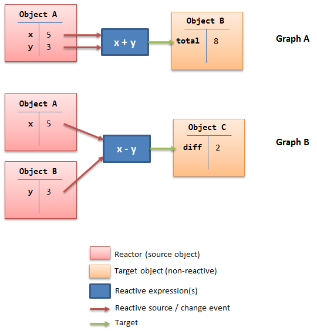
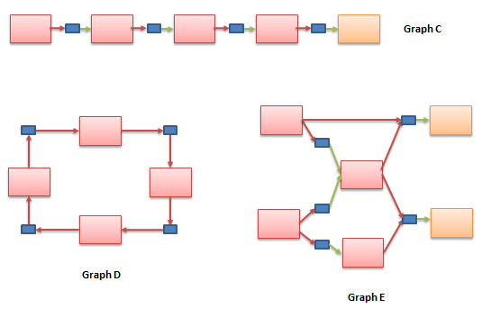

# Reactive Programming

* [Concept](#concept)
	* [Glossary](#glossary)
	* [Static Relations](#static-relations)
	* [Dynamic Relations](#dynamic-relations)
* [API](#api)
	* [react](#react)
	* [is](#is)
	* [react?](#react-)
	* [clear-reactions](#clear-reactions)
	* [dump-reactions](#dump-reactions)
* [Reactive Objects](#reactive-objects)
	* [reactor!](#reactor)
	* [deep-reactor!](#deep-reactor)

# Concept

Since version 0.6.0, Red has introduced support for "reactive programming" which purpose is to reduce size and complexity of Red programs further. Red's reactive model relies on dataflow and object events, constructing a directed graph, allowing propagation of changes in objects, following the "push" model. More specifically, Red implements the [object-oriented reactive programming](https://en.wikipedia.org/wiki/Reactive_programming#Object-oriented) model, where only object fields can be the source of change.

If the description seems a bit abstract, the reactive API and usage are meant to be simple and practical. Here are some graphs to help visualize the relationships created by reactive relations.

*Graph A & B are showing simple relations built between one or several reactors (an object acting as a reactive source).*

*Graphs C, D & E are showing chained reaction, where most targets are themselves reactors, setting up a chain of relations which can have any shape.*

Once set, reactions are run asynchronously, each time one of the source field(s) value is changed. This relation continues to exists until the reaction is explicitly destroyed, using `react/unlink` or `clear-reactions`.

Only the source objects in a reactive expression need to be a reactor, the target can be a simple object. If the target is also a reactor, then reactions can be chained and a graph of relations can then be constructed.

Notes: 
* Red's reactive support could be extended in the future to support also a "pull" model.
* This is not a [FRP](https://en.wikipedia.org/wiki/Functional_reactive_programming) framework, though event streams could be supported in the future.
* The Red/View GUI engine relies on *face!* objects in order to operate graphic objects. Faces are reactors, and they can be used for setting reactive relations between them or with non-reactor objects.

## Glossary

Expression | Definition
---------- | ----------
**reactive programming** | A programming paradigm, subset of dataflow programming, relying on events pushing changes.
**reaction**	| A block of code which contains one or more reactive expressions.
**reactive expression** | An expression which references at least one reactive source.
**reactive relation** | A relation between two or more objects implemented using reactive expression(s).
**reactive source** | A path! value referring to an reactive object field.
**reactive formula** | A reaction which returns the last expression result on evaluation.
**reactive object** | An object which fields can be used as reactive sources.
**reactor**	 | Alias for "reactive object".

## Static Relations

The simplest form of reactions is a so-called "static relation" created between *named* objects. It is *static* because it statically links objects, it uniquely applies to its source reactors, it cannot be re-used for other objects.

**Example 1**

	view [
		s: slider return
		b: base react [b/color/1: to integer! 255 * s/data]
	]

This example sets a reactive relation between a slider named `sld` and a base face named `b`. When the slider is moved, the base face background red component is changed accordingly. The reactive expression cannot be re-used for a different set of faces. This is the simplest form of reactive behavior you can set for graphic objects in Red/View.

**Example 2**

    vec: make reactor! [x: 0 y: 10]
    box: object [length: is [square-root (vec/x ** 2) + (vec/y ** 2)]]

This other example is not related to GUI, it calculates the length of a vector defined by `vec/x` and `vec/y` using a reactive expression. Once again, the source object is statically specified, using its name (`vec`) in the reactive expression.

Another form of static relations can be defined using `is` operator, where the resulting value of the reaction evaluation will be set to a word (in any context).

**Example 3**

	a: make reactor! [x: 1 y: 2 total: is [x + y]]
	
The word `total` above has its value set to the `x + y` expression. Each time `x` or `y` values change, `total` will be immediatly updated. Notice that path are not used in this case to specify the reactive sources, as `is` is used directly inside a reactor's body.

**Example 4**

	a: make reactor! [x: 1 y: 2]
	total: is [a/x + a/y]

This variation of Example 3 shows that a global word can also be the target of a reactive relation (but cannot be the source). This form is the closest to the Excel formula model.

Note: due to the size of global context, making it reactive could have a significant overall slowdown on Red's performances, though, that could be overcome in the future.

## Dynamic Relations

Static relations are very simple to specify, but they don't scale well if you need to provide the same reaction to a great number of reactors, or if the reactors are anonymous (reminder: all objects are anonymous by default). In such case, the reaction needs to be specified using a *function* and `react/link` form.

**Example**

	win: layout [
		size 400x500
		across
		style ball: base 30x30 0.0.0.255 draw [fill-pen blue circle 15x15 14]
		ball ball ball ball ball ball ball b: ball loose
		do [b/draw/2: red]
	]
	
	follow: func [left right][left/offset/y: to integer! right/offset/y * 108%]
	
	faces: win/pane
	while [not tail? next faces][
		react/link :follow [faces/1 faces/2]
		faces: next faces
	]
	view win

In this example, the reaction is a function (`follow`) which is applied to the ball faces by pairs, setting a chain of relations, linking together all the balls. The terms in the reaction are parametrized, so they can be reused for different sets of object arguments (unlike in the static relations case).

# API

## react

**Syntax**

    react <code>
    react/link <func> <objects>
    react/unlink <code> <source>
    react/unlink <func> <source>
    react/later <code>
    
    <code>    : block of code containing at least one reactive source (block!).
    <func>    : function containing at least one reactive source (function!).
    <objects> : list of objects used as arguments to a reactive function (block! of object! values).
    <source>  : 'all word, or an object or a list of objects (word! object! block!).
    
    Returns   : <code> or <func> for further references to the reaction.
    
**Description**

Sets a new reactive relation which contains at least one reactive source, from:
* a block of code (sets a "static relation")
* a function (sets a "dynamic relation")

In both cases, the code is statically analyzed to determine the reactive sources, in the form of path! values, referring to reactor fields. The newly formed reaction **is called once** on creation (before the `react` function returns). This default behavior can be undesirable in some cases, this initial triggering can be avoided using the `/later` option.

A reaction can contain arbitrary Red code, have one or several reactive sources, one or several reactive expressions. It is up to the user to determine the granularity of relations to set up, which best fits his use-cases.

The `/link` option takes a function as the reaction and a list of arguments objects to be used when evaluating the reaction. This alternative form allows dynamic reactions, where the reaction code can be reused with different sets of objects (the basic `react` can only work with statically *named* objects).

Removing a reaction is achieved by using `/unlink` refinement with a `<source>` argument which can take the following values:
* `'all` word, will remove all reactive relations created by the reaction.
* an object value, will remove only relations where that object is the reactive source.
* a list of objects, will remove only relations where those objects are the reactive source.

`/unlink` takes a reaction block or function as argument, so only relations created from *that* reaction will be removed.

## is

**Syntax**

    <word>: is <code>
    
    <word> : word to be set to the result of the reaction (set-word!).
    <code> : block of code containing at least one reactive source (block!).
    
**Description**

The `is` operator creates a reactive formula, which result will be assigned to a word. The `<code>` block can contain reference to both wrapping object's fields (if used in a reactor's body block), and external reactors fields.

Note: this operator creates reactive formula which are very close to Excel's formula model.

**Example**

    a: make reactor! [x: 1 y: 2 total: is [x + y]]
    
    a/total
    == 3
    a/x: 100
    a/total
    == 102

## react?

**Syntax**

    react? <obj> <field>
    
    <obj>   : object to check (object!).
    <field> : object's field to check (word!).
    
    Returns : a reaction (block! function!) or a none! value.
    
**Description**

Checks if an object's field is a reactive source. If it is true, then the first reaction found where that object's field is present will be returned, otherwise `none` is returned.

## clear-reactions

**Syntax**

    clear-reactions
    
**Description**

Removes all defined reactions unconditionally.

## dump-reactions

**Syntax**

    dump-reactions
    
**Description**

Output a list of registered reactions for debugging purposes.

# Reactive Objects

Ordinary objects in Red do not exhibits reactive behaviors. In order for an object to be a reactive source, it needs to be constructed from one of the following reactor prototypes.

## reactor!

**Syntax**

    make reactor! <body>
    
    <body> : body block of the object  (block!).
    
    Returns : a reactive object.
    
**Description**

Constructs a new reactive object from the body block. Only setting a field to a new value can trigger reactions (if defined for that field).

Note: The body block can eventually contain `is` expressions.

## deep-reactor!

**Syntax**

    make deep-reactor! <body>
    
    <body> : body block of the object  (block!).
    
    Returns : a reactive object.
    
**Description**

Constructs a new reactive object from the body block. Setting a field to a new value or changing a referred series deeply can trigger reactions (if defined for that field).

Note: The body block can eventually contain `is` expressions.
