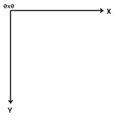
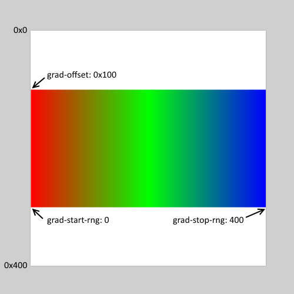

= Draw 方言
:imagesdir: ../images
:toc:
:toclevels: 3
:toc-title: 目录
:numbered:

== 摘要

Draw 是 Red 语言的一个方言（DSL），它提供了一个简单、声明式的方式来指定 2D 绘图操作，这样的操作表示为有序命令的列表（用内含值的区块）, 可以在运行时自由地构造和修改。

Draw 区块可以使用 `draw` 函数直接渲染在图像之上，或在 View 元件内使用 `draw` 特征渲染（参照 link:view.adoc[View 文档]）。

== 绘图命令

命令可以是绘图指令或绘图指令的设定，当设置了一种模式后，它将影响当前 Draw 会话中后续的所有操作（直到被更改）。

大多数 Draw 命令需要指定坐标，它使用的二维坐标系统为：

* X 轴：在显示器上从左到右增加。
* Y 轴：在显示器上从上到下增加。

一些绘图命令需要指定长度，长度以像素为单位。

=== `line`

*语法*

[source, red]
----
line <point> <point> ...

<point> : 点的坐标 (pair!)。
----

*描述*

在两点之间绘制一条直线。如果指定了更多的点，则以提供的顺序连接每个点，绘制附加的直线。

=== `triangle`

*语法*

[source, red]
----
triangle <point> <point> <point>

<point> : 三角形顶点的坐标 (pair!)。
----

[NOTE, caption=注意]
====
顶点是两条线交汇的地方，是边相交的点。
====

*描述*

连接提供的顶点以绘制三角形。

=== `box`

*语法*

[source, red]
----
box <top-left> <bottom-right>
box <top-left> <bottom-right> <corner>

<top-left>     : 矩形左上角的坐标 (pair!)。
<bottom-right> : 矩形右下角的坐标 (pair!)。
<corner>       : （可选）用来画圆角的圆弧的半径 (integer!)。
----

*描述*

使用左上角（第一个参数）和右下角（第二个参数）顶点绘制矩形。可以提供一个可选的半径用来画圆角。

=== `polygon`

*语法*

[source, red]
----
polygon <point> <point> ...

<point> : 顶点坐标 (pair!)。
----

*描述*

使用提供的顶点绘制多边形。最后一个点不需要是起点，无论如何它都会画一条额外的线来闭合这个多边形，要提供的最少的点的个数为 3。

=== `circle`

*语法*

[source, red]
----
circle 
 <radius>
circle 
 <radius-x> <radius-y>

   : 圆的圆心坐标 (pair!)。
<radius>   : 圆的半径 (integer! float!)。
<radius-x> :（椭圆模式）沿 X 轴的圆的半径 (integer! float!)。
<radius-y> :（椭圆模式）沿 Y 轴的圆的半径 (integer! float!)。
----

*描述*

由提供的圆心和半径值绘制一个圆。通过添加一个可选的整数表示沿 Y 轴方向的半径（另一个半径参数就变成了沿 X 的半径），可以使圆变形成椭圆。

=== `ellipse`

*语法*

[source, red]
----
ellipse <top-left> <size>

<top-left> : 椭圆的包围盒的左上角的点的坐标 (pair!)。
<size>     : 包围盒的大小 (pair!)。
----

*描述*

由指定的包围盒绘制椭圆，`size` 参数代表于该椭圆的 X 和 Y 直径。

[NOTE, caption=注意]
====
与 `circle` 命令相比，`ellipse` 提供了一种更紧凑、面向包围盒的方式来指定一个圆/椭圆。
====

=== `arc`

*语法*

[source, red]
----
arc 
 <radius> <begin> <sweep>
arc 
 <radius> <begin> <sweep> closed

 : 圆的圆心的坐标 (pair!)。
<radius> : 圆的半径 (pair!)。
<begin>  : 起始角，以角度为单位 (integer!)。
<sweep>  : 圆弧的起点和终点之间的角，以角度为单位 (integer!)。
----

*描述*

由提供的圆心和半径值绘制圆弧，以两个角的值定义圆弧。可以使用一个可选的 `closed` 关键字，用两条起始自圆心的直线来绘制闭合的圆弧。

=== `curve`

*语法*

[source, red]
----
curve <end-A> <control-A> <end-B>
curve <end-A> <control-A> <control-B> <end-B>

<end-A>     : 端点 A (pair!)。
<control-A> : 控制点 A (pair!)。
<control-B> : 控制点 B (pair!)。
<end-B>     : 端点 B (pair!)。
----

*描述*

由 3 或 4 个点绘制贝塞尔曲线：

* 3 个点：2 个端点，1 个控制点。
* 4 个点：2 个端点，2 个控制点。

4 个点可以允许创建更复杂的曲线。

=== `spline`

*语法*

[source, red]
----
spline <point> <point> ...
spline <point> <point> ... closed

<point> : 控制点 (pair!)。
----

*描述*

由一组点的序列绘制 B 样条曲线，需要至少 3 个点来生成样条曲线。可选的 `closed` 关键字将绘制一个从终点到起点的额外的线段，用来闭合这个样条曲线。

[NOTE, caption=注意]
====
允许只用2个点，但它们只会生成一条直线。
====

=== `image`

*语法*

[source, red]
----
image <image>
image <image> <top-left>
image <image> <top-left> <bottom-right>
image <image> <top-left> <top-right> <bottom-left> <bottom-right>
image <image> <top-left> <top-right> <bottom-left> <bottom-right> <color>
image <image> <top-left> <top-right> <bottom-left> <bottom-right> <color> border
image <image> <top-left> <top-right> <bottom-left> <bottom-right> <color> crop <offset> <size>

<image>        : 用来显示的图像 (image! word!)。
<top-left>     : （可选）图像左上角的坐标 (pair!)。
<top-right>    : （可选）图像右上角的坐标 (pair!)。
<bottom-left>  : （可选）图像左下角的坐标 (pair!)。
<bottom-right> : （可选）图像右下角的坐标 (pair!)。
<color>        : （可选）用来使其透明的基本色 (tuple! word!)。
<offset>       : （可选）开始裁剪的位置 (pair!)。
<size>         : （可选）裁剪的尺寸 (pair!)。
----

*描述*

使用提供的位置和宽度信息描画图像。如果该图像没有提供定位信息，那么它会被画在 `0x0` 坐标上。可以可选地提供一个颜色值用于指定透明度。

[NOTE, caption=注意]
====
* 四点画图的模式尚未实现，它将允许用 4 个任意摆放的边来拉伸图像。
* `border`（边框）可选模式尚未实现
====

=== `text`

*语法*

[source, red]
----
text <position> <string>

<position> : 这个字符串会被打印在的坐标 (pair!)。
<string>   : 要打印的字符串 (string!)。
----

*描述*

使用当前字体在提供的坐标处打印文本字符串。 

[NOTE, caption=注意]
====
如果没有选择字体或字体颜色设置为 `none`，则用画笔颜色代替。
====

=== `font`

*语法*

[source, red]
----
font 

 : 要使用的新的字体对象 (object! word!)。
----

*描述*

选择要用于文本打印的字体，字体对象是一个 `font!` 类型的拷贝。

=== `pen`

这个命令定义其他命令的轮廓绘制模式。从简单的单一颜色到嵌套的自定义形状与渐变，许多不同的选项都可以使用。

==== 彩色画笔

*语法*

[source, red]
----
pen <color>

<color> : 用于绘制的新颜色 (tuple! word!)。
----

*描述*

选定要用于绘制操作的颜色。到画笔被设置为 `off` 为止，所有形状都会用所选的颜色进行绘制。

==== 线性渐变画笔

*语法*

[source, red]
----
pen linear <color1> <offset> ... <colorN> <offset> <start> <end> <spread>

<color1/N> : 渐变颜色的列表 (tuple! word!)。
<offset>   : （可选）渐变颜色的偏移 (float!)。
<start>    : （可选）起点（pair!）。 
<end>      : （可选，除非有 <start>）终点 (pair!)。
<spread>   : （可选）传播方法 (word!)。
----

*描述*

设置用于绘制操作的线性渐变。传播方法可接受以下的值：`pad`（填充）、`repeat`（重复）、`reflect`（反射）（目前在 Windows 平台下 `pad` 跟 `repeat` 相同）。

当起点/终点被使用时，它们将定义描画渐变所沿的直线；若没被使用，渐变将沿着当前绘制的形状内的水平直线描画。

==== 径向渐变画笔

*语法*

[source, red]
----
pen radial <color1> <offset> ... <colorN> <offset> 
 <radius> <focal> <spread>

<color1/N> : 渐变颜色的列表 (tuple! word!)。
<offset>   : （可选）渐变颜色的偏移 (float!)。

   : （可选）圆心 (pair!)。
<radius>   : （可选，除非有 
）用于沿着描画的圆的半径 (integer! float!)。
<focal>    : （可选）焦点 (pair!)。
<spread>   : （可选）传播方法 (word!)。
----

*描述*

设置用于绘制操作的径向渐变。传播方法可接受以下的值：`pad`（填充）、`repeat`（重复）、`reflect`（反射）（目前在 Windows 平台下 `pad` 跟 `repeat` 相同）。

从焦点到由圆心与半径定义的圆的边缘描画径向渐变。起始颜色将描画在焦点处，终止颜色将描画在这个圆的边缘。

==== 菱形渐变画笔

*语法*

[source, red]
----
pen diamond <color1> <offset> ... <colorN> <offset> <upper> <lower> <focal> <spread>

<color1/N> : 渐变颜色的列表 (tuple! word!)。
<offset>   : （可选）渐变颜色的偏移 (float!)。
<upper>    : （可选）矩形的上角落 (pair!)。
<lower>    : （可选，除非有 <upper>）矩形的下角落 (pair!)。
<focal>    : （可选）焦点 (pair!)。
<spread>   : （可选）传播方式 (word!)。
----

*描述*

设置用于绘制操作的菱形渐变。传播方法可接受以下的值：`pad`（填充）、`repeat`（重复）、`reflect`（反射）（目前在 Windows 平台下 `pad` 跟 `repeat` 相同）。

从焦点到由上角落与下角落定义的矩形的边缘描画菱形渐变。起始颜色将描画在焦点处，终止颜色将描画在这个菱形的边缘。

==== 图案画笔

*语法*

[source, red]
----
pen pattern <size> <start> <end> <mode> [<commands>]

<size>     : 绘制 <commands> 的内部图像的大小 (pair!)。
<start>    : （可选）内部图像中裁剪部分的上角落 (pair!)。
<end>      : （可选）内部图像中裁剪部分的下角落 (pair!)。
<mode>     : （可选）平铺模式 (word!)。
<commands> : 定义图案的 Draw 命令区块。
----

*描述*

将一个自定义形状设置为用于绘制操作的图案。平铺模式可接受以下的值：`tile`（平铺）（默认）、`flip-x`（X 翻转）、`flip-y`（Y 翻转）、`flip-xy`（XY 翻转）、`clamp`。

默认起点为 `0x0`，终点为 `<size>`。

==== 位图画笔

*语法*

[source, red]
----
pen bitmap  <image> <start> <end> <mode>

<image> : 用于平铺的图像 (image!)。
<start> : （可选）图像裁剪部分的上角落 (pair!)。
<end>   : （可选）图像裁剪部分的下角落 (pair!)。
<mode>  : （可选）平铺模式 (word!)。
----

*描述*

将一个自定义形状设置为用于绘制操作的图案。平铺模式可接受以下的值：`tile`（平铺）（默认）、`flip-x`（X 翻转）、`flip-y`（Y 翻转）、`flip-xy`（XY 翻转）、`clamp`。

默认起点为 `0x0`，终点为图像大小。

==== 关闭画笔

*语法*

[source, red]
----
pen off
----

*描述*

停止后续命令的所有轮廓绘制操作。

=== `fill-pen`

此命令定义了其他需要填充操作的命令（封闭形状）的填充模式。从简单的单一颜色到嵌套的自定义形状与渐变，许多不同的选项都可以使用。

==== 颜色填充

*语法*

[source, red]
----
fill-pen <color>

<color> : 用于填充的新颜色 (tuple! word!)。
----

*描述*

选定要用于填充操作的颜色。到颜色填充被设置为 `off` 为止，所有封闭的形状将被所选颜色填充。

==== 渐变填充

*语法*

[source, red]
----
fill-pen linear <color1> <offset> ... <colorN> <offset> <start> <end> <spread>

<color1/N> : 渐变颜色的列表 (tuple! word!)。
<offset>   : （可选）渐变色偏移 (float!)。
<start>    : （可选）起点（pair!）。 
<end>      : （可选，除非有 <start>）终点 (pair!)。
<spread>   : （可选）传播方法 (word!)。
----

*描述*

设置用于填充操作的线性渐变。传播方法可接受以下的值：`pad`（填充）、`repeat`（重复）、`reflect`（反射）（目前在 Windows 平台下 `pad` 跟 `repeat` 相同）。

当起点/终点被使用时，它们将定义描画渐变所沿的直线；若没被使用，渐变将沿着当前绘制的形状内的水平直线描画。

==== 径向渐变填充

*语法*

[source, red]
----
fill-pen radial <color1> <offset> ... <colorN> <offset> 
 <radius> <focal> <spread>

<color1/N> : 渐变颜色的列表 (tuple! word!)。
<offset>   : （可选）渐变色偏移 (float!)。

   : （可选）圆心 (pair!)。
<radius>   : （可选，除非有 
）用于沿着描画的圆的半径 (integer! float!)。
<focal>    : （可选）焦点 (pair!)。
<spread>   : （可选）传播方法 (word!)。
----

*描述*

设置用于填充操作的径向渐变。传播方法可接受以下的值：`pad`（填充）、`repeat`（重复）、`reflect`（反射）（目前在 Windows 平台下 `pad` 跟 `repeat` 相同）。

从焦点到由圆心与半径定义的圆的边缘描画径向渐变。起始颜色将描画在焦点处，终止颜色将描画在这个圆的边缘。

==== 菱形渐变填充

*语法*

[source, red]
----
fill-pen diamond <color1> <offset> ... <colorN> <offset> <upper> <lower> <focal> <spread>

<color1/N> : 渐变颜色的列表 (tuple! word!)。
<offset>   : （可选）渐变颜色的偏移 (float!)。
<upper>    : （可选）矩形的上角落。（pair!）。 
<lower>    : （可选，除非有 <upper>）矩形的下角落 (pair!)。
<focal>    : （可选）焦点 (pair!)。
<spread>   : （可选）传播方式 (word!)。
----

*描述*

设置用于填充操作的菱形渐变。传播方法可接受以下的值：`pad`（填充）、`repeat`（重复）、`reflect`（反射）（目前在 Windows 平台下 `pad` 跟 `repeat` 相同）。

从焦点到由上角落与下角落定义的矩形的边缘描画菱形渐变。起始颜色将描画在焦点处，终止颜色将描画在这个菱形的边缘。

==== 图案填充

*语法*

[source, red]
----
fill-pen pattern <size> <start> <end> <mode> [<commands>]

<size>     : 绘制 <commands> 的内部图像的大小 (pair!)。
<start>    : （可选）内部图像中裁剪部分的上角落 (pair!)。
<end>      : （可选）内部图像中裁剪部分的下角落 (pair!)。
<mode>     : （可选）平铺模式 (word!)。
<commands> : 定义图案的 Draw 命令区块。
----

*描述*

将一个自定义形状设置为用于填充操作的图案。平铺模式可接受以下的值：`tile`（平铺）（默认）、`flip-x`（X 翻转）、`flip-y`（Y 翻转）、`flip-xy`（XY 翻转）、`clamp`。

默认起点为 `0x0`，终点为 `<size>`。

==== 位图填充

*语法*

[source, red]
----
fill-pen bitmap  <image> <start> <end> <mode>

<image> : 用于平铺的图像 (image!)。
<start> : （可选）图像裁剪部分的上角落 (pair!)。
<end>   : （可选）图像裁剪部分的下角落 (pair!)。
<mode>  : （可选）平铺模式 (word!)。
----

*描述*

将一个自定义形状设置为用于填充操作的图案。平铺模式可接受以下的值：`tile`（平铺）（默认）、`flip-x`（X 翻转）、`flip-y`（Y 翻转）、`flip-xy`（XY 翻转）、`clamp`。

默认起点为 `0x0`，终点为图像大小。

==== 关闭填充

*语法*

[source, red]
----
fill-pen off
----

*描述*

停止后续命令的所有填充操作。

=== `line-width`

*语法*

[source, red]
----
line-width <value>

<value> : 新的线条宽度，以像素为单位 (integer!)。
----

*描述*

为画线操作设置新的宽度。

=== `line-join`

*语法*

[source, red]
----
line-join <mode>

<mode> : 新的线条接合模式 (word!)。
----

*描述*

为画线操作设置新的线条接合模式，可接受以下的值：

* `miter`（斜角）（默认）
* `round`（圆角）
* `bevel`（斜面）
* `miter-bevel`（斜角-斜面）

image::../images/line-join.png[Line-join,align="center"]

[NOTE, caption=注意]
====
`miter-bevel` 模式将根据斜角长度自动选择其中一个接合模式（详情参考link:https://msdn.microsoft.com/en-us/library/windows/desktop/ms534148%28v=vs.85%29.aspx[此页面]）。
====

=== `line-cap`

*语法*

[source, red]
----
line-cap <mode>

<mode> : 新的线条端点模式 (word!)。
----

*描述*

为绘制线条操作设置新的线条末尾端点模式，可接受以下的值：

* `flat`（扁平）（默认）
* `square`（方块）
* `round`（圆角）

image::../images/line-cap.png[Line-cap,align="center"]

=== `anti-alias`

*语法*

[source, red]
----
anti-alias <mode>

<mode> : 用 `on` 启用或用 `off` 禁用反锯齿。
----

*描述*

为后续的 Draw 命令启用/关闭反锯齿模式。

[NOTE, caption=注意]
====
反锯齿可以提供更好看的视觉渲染，但会降低性能。
====

=== `matrix`

*语法*

[source, red]
----
matrix <matrix-setup>
matrix 'pen <matrix-setup>
matrix 'fill-pen <matrix-setup>

<matrix-setup> : 前/后乘以当前矩阵的矩阵 (block!)。
----

*描述*

执行矩阵乘法。当前的变换矩阵前会被这个矩阵前乘。

`matrix-setup` 区块里必须有 6 个数值 (number!)。

[source, red]
----
matrix [a b c d e f]
----

该区块里的值用于构建以下的变换矩阵：

----
|a c e|
|b d f|
|0 0 1|
----

当 `'pen` 或 `'fill-pen` 原词被使用时，乘法分别会应用到当前画笔或当前填充笔上。

=== `reset-matrix`

*语法*

[source, red]
----
reset-matrix
reset-matrix 'pen
reset-matrix 'fill-pen
----

*描述*

将当前变换矩阵重置为单位矩阵。

当 `'pen` 或 `'fill-pen` 原词被使用时，该重置操作分别会应用到当前的画笔或当前的填充笔上。

----
|1 0 0|
|0 1 0|
|0 0 1|
----

=== `invert-matrix`

*语法*

[source, red]
----
invert-matrix
invert-matrix 'pen
invert-matrix 'fill-pen
----

*描述*

在当前变换矩阵上应用代数矩阵求逆操作。

当 `'pen` 或 `'fill-pen` 原词被使用时，该求逆操作分别会应用于当前的画笔或当前的填充笔上。

=== `push`

*语法*

[source, red]
----
push <draw-block>

<draw-block> : Draw 命令区块 (block!)。
----

*描述*

保存当前状态（变换、裁剪区域和画笔设置）到栈上。然后你可以在该 `push` 命令区块内更改当前的变换矩阵和画笔等等。在该 `push` 命令区块后，当前状态会出栈并还原到当前状态。`push` 命令可以嵌套。

=== `rotate`

*语法*

[source, red]
----
rotate <angle> 
 [<commands>]
rotate 'pen <angle>
rotate 'fill-pen <angle>

<angle>    : 以角度为单位的角 (integer! float!)。

   : （可选）旋转中心 (pair!)。
<commands> : （可选）Draw 方言命令。
----

*描述*

设置关于一个给定点的顺时针旋转，以度为单位。如果不提供可选项 `center`，将会关于当前用户坐标系统的原点旋转。负数可用于逆时针旋转。当提供的最后一个参数为区块时，旋转将仅应用于该区块中的命令。

当 `'pen` 或 `'fill-pen` 原词被使用时，该旋转操作分别会应用到当前的画笔或当前的填充笔上。

=== `scale`

*语法*

[source, red]
----
scale <scale-x> <scale-y> [<commands>]
scale 'pen <scale-x> <scale-y>
scale 'fill-pen <scale-x> <scale-y>

<scale-x>  : X 缩放值 (number!)。
<scale-y>  : Y 缩放值 (number!)。
<commands> : （可选）Draw 方言命令。
----

*描述*

设置缩放值。给定值为乘数：使用大于 1 的值来增加缩放；使用小于 1 的值来缩小它。当提供的最后一个参数为区块时，缩放将仅应用于该区块中的命令。

当 `'pen` 或 `'fill-pen` 原词被使用时，该缩放操作分别会应用于当前的画笔或当前的填充笔上。

=== `translate`

*语法*

[source, red]
----
translate <offset> [<commands>]
translate 'pen <offset>
translate 'fill-pen <offset>

<offset>   : 平移量 (pair!)。
<commands> : （可选）Draw 方言命令。
----

*描述*

设置绘图命令的原点。多个平移命令将具有累积效应。当提供的最后一个参数为区块时，平移操作将仅应用于该区块中的命令。

当 `'pen` 或 `'fill-pen` 原词被使用时，该平移操作分别会应用到当前的画笔或当前的填充笔上。

=== `skew`

*语法*

[source, red]
----
skew <skew-x> <skew-y> [<commands>]
skew 'pen <skew-x> <skew-y>
skew 'fill-pen <skew-x> <skew-y>

<skew-x>   : 沿 x 轴的倾斜度，以角度为单位 (integer! float!)。
<skew-y>   : （可选）沿 y 轴的倾斜度，以角度为单位 (integer! float!)。
<commands> : （可选）Draw 方言命令。
----

*描述*

设置相对于原先的坐标系统倾斜了给定度数的坐标系统。如果没有提供 `<skew-y>`，它将被认为是零。当提供的最后一个参数为区块时，倾斜将仅应用于该区块中的命令。

当 `'pen` 或 `'fill-pen` 原词被使用时，该倾斜操作分别会应用到当前的画笔或当前填充笔上。

=== `transform`

*语法*

[source, red]
----
transform <angle> 
 <scale-x> <scale-y> <translation> [<commands>]
transform 'pen <angle> 
 <scale-x> <scale-y> <translation>
transform 'fill-pen <angle> 
 <scale-x> <scale-y> <translation>

<angle>       : 旋转角，以度为单位 (integer! float!)。

      : （可选）旋转中心 (pair!)。
<scale-x>     : X 缩放值 (number!)。
<scale-y>     : Y 缩放值 (number!)。
<translation> : 平移量 (pair!)。
<commands>    : （可选）Draw 方言命令。
----

*描述*

设置变换，如平移、缩放和旋转。当提供的最后一个参数为区块时，该变换将仅应用于该区块中的命令。

当 `'pen` 或 `'fill-pen` 原词被使用时，该变换操作分别会应用在当前的画笔或当前的填充笔上。

=== `clip`

*语法*

[source, red]
----
clip <start> <end> <mode> [<commands>]
clip [<shape>] <mode> [<commands>]

<start>    : 裁剪区域的左上角点 (pair!)
<end>      : 裁剪区域的右下角点 (pair!)
<mode>     : （可选）裁剪区域之间的合并模式 (word!)
<commands> : （可选）Draw 方言命令。
<shape>    : Shape 方言命令。
----

*描述*

定义一个由两点定义的（`start` 和 `end`）矩形裁剪区域或由内含 Shape 子方言命令的区块定义的任意形状的裁剪区域。该裁剪适用于所有后续 Draw 命令。当提供的最后一个参数为区块时，裁剪将仅应用于该区块中的命令。

另外，新的裁剪区域和前一个裁剪区域之间的组合模式可以设置为以下之一：

* `replace`（替换）（默认）
* `intersect`（交集）
* `union`（并集）
* `xor`（异或）
* `exclude`（排除）

== `shape` 命令

*语法*

[source, red]
----
shape [<commands>]

<commands> : shape 方言命令。
----

*描述*

`shape` 关键字可以访问 Shape 子方言绘图命令。这种绘图方言的具体特点是：

* 画笔的位置可以独立于绘图操作移动。
* 每个绘图命令起始于当前画笔位置。
* 形状自动闭合（无需绘制最后一个回到起始位置的笔划）。
* 生成的形状可以传到 `fill-pen` 以进行简单的或复杂的填充。
* 坐标可以是绝对的（像在 Draw 中）或相对于最后的画笔位置。

[NOTE, caption=注意]
====
所有绘图命令都默认使用绝对坐标，使用原词版本的命令的话会切换成相对坐标的命令。
====

=== `move`

*语法*

[source, red]
----
 move <position>            （绝对）
'move <position>            （相对）

<position> : 新的画笔位置 (pair!)。
----

*描述*

将画笔移动到新的位置，不会发生绘制。

=== `line`

*语法*

[source, red]
----
 line <point> <point> ...   （绝对）
'line <point> <point> ...   （相对）

<point> : 点的坐标 (pair!)。
----

*描述*

在两点之间绘制一条直线。如果指定了更多的点，则以提供的顺序连接每个点，绘制附加的直线。

=== `arc`

*语法*

[source, red]
----
 arc <end> <radius-x> <radius-y> <angle> sweep closed       （绝对）
'arc <end> <radius-x> <radius-y> <angle> sweep closed       （相对）

<end>      : 圆弧的终点 (pair!)。
<radius-x> : 沿 x 轴的圆半径 (integer! float!)。
<radius-y> : 沿 y 轴的圆半径 (integer! float!)。
<angle>    : 圆弧起点到终点之间的角，以度为单位 (integer! float!)。
sweep      : （可选）以正角度方向绘制圆弧。
large      : （可选）产生一个膨胀的圆弧（伴随着 'sweep 选项）。
----

*描述*

在当前画笔位置与终点之间用半径值绘制圆弧，圆弧由一个角度值定义。

=== `curve`

*语法*

[source, red]
----
 curve <point> <point> <point> ...   （绝对）
'curve <point> <point> <point> ...   （相对）

<point> : 点的坐标 (pair!)。
----

*描述*

从当前的画笔位置开始，用一组点的序列绘制三次贝塞尔曲线。需要至少 3 个点才能产生曲线（第一个点为隐含的起点）。

=== `curv`

*语法*

[source, red]
----
 curv <point> <point> ...   （绝对）
'curv <point> <point> ...   （相对）

<point> : 坐标点 (pair!)。
----

*描述*

从当前的画笔位置开始，用一组点的序列绘制平滑三次贝塞尔曲线。需要至少 2 个点才能产生曲线（第一个点为隐含的起点）。

[NOTE, caption=注意]
====
摘自 http://www.w3.org/TR/SVG11/paths.html
====

"`第一个控制点被认为是在前一个命令的第二个控制点相对于当前点的反演。（如果之前没有曲线命令，则第一个控制点为当前点）`"

=== `qcurve`

*语法*

[source, red]
----
 qcurve <point> <point> ...   （绝对）
'qcurve <point> <point> ...   （相对）

<point> : 点的坐标 (pair!)。
----

*描述*

从当前的画笔位置开始，用一组点的序列绘制二次贝塞尔曲线。需要至少 2 个点才能产生曲线（第一个点为隐含的起点）。

=== `qcurv`

*语法*

[source, red]
----
 qcurv <point>   （绝对）
'qcurv <point>   （相对）

<point> : 终点的坐标 (pair!)。
----

*描述*

从当前画笔位置到指定的终点绘制平滑二次贝塞尔曲线。

[NOTE, caption=注意]
====
参照：http://www.w3.org/TR/SVG11/paths.html
====

=== `hline`

*语法*

[source, red]
----
 hline <end-x>   （绝对）
'hline <length>  （相对）

<end-x>  : 沿 X 轴的终点位置 (integer! float!)。
<length> : 线段的长度 (integer! float!)。
----

*描述*

从当前画笔位置起绘制一条水平线。

=== `vline`

*语法*

[source, red]
----
 vline <end-y>   （绝对）
'vline <length>  （相对）

<end-y>  : 沿 Y 轴的终点位置 (integer! float!)。
<length> : 线段的长度 (integer! float!)。
----

*描述*

从当前画笔位置起绘制一条垂直线。

=== `line-width`

与 Draw 方言相同。

=== `line-join`

与 Draw 方言相同。

=== `line-cap`

与 Draw 方言相同。

=== `pen`

与 Draw 方言相同。

=== `fill-pen`

与 Draw 方言相同。

== 默认值

当一个新的 Draw 会话开始时，以下默认值将被使用:

[cols="2,3", options="header"]
|===
|属性        | 值
|`background`| `white`
|`pen color` | `black`
|`filling`   | `off`
|`anti-alias`| `on`
|`font`      | `none`
|`line width`| `1`
|`line join` | `miter`
|`line cap`  | `flat`
|===

== 子区块

在 Draw 代码内部，可以使用区块任意地对命令进行编组，语义保持不变。目前这仅是个语法糖，它允许对命令进行更轻松的成组操纵（尤其是成组提取/插入/删除）更加轻松。可以使用空区块。

== 源位置

在 Draw 代码中，设词可以放在命令**之间**，用来记录在 Draw 区块中当前的位置，并能够在以后轻松地访问。

[NOTE, caption=注意]
====
如果设词之前的 Draw 区块长度被改变了，原有的位置会随之改变，所以设词不再会指向同一引用。
====

== `draw` 函数

可以使用 `draw` 函数将 Draw 区块直接渲染到图像中。

*语法*

[source, red]
----
draw <size> <spec>
draw <image> <spec>

<size>  : 新图像的大小 (pair!)。
<image> : 用作画布的图像 (image!)。
<spec>  : Draw 命令区块 (block!)。
----

*描述*

将提供的 Draw 命令渲染到现有的或新的图像中，该函数返回一个图像值。

== 弃用的 API

填充笔也支持一个弃用的 API，它仅是为了兼容 Rebol/Draw, 不应该在新的 Red 脚本中使用它。

*语法*

[source, red]
----
fill-pen linear <grad-offset> <grad-start-rng> <grad-stop-rng>
         <grad-angle> <grad-scale-x> <grad-scale-y> <grad-color> <offset>
         <grad-color> <offset> ...

fill-pen radial <grad-offset> <grad-focal> <grad-radius>
         <grad-angle> <grad-scale-x> <grad-scale-y> <grad-color> <offset>
         <grad-color> <offset> ...

fill-pen diamond <grad-offset> <grad-focal> <grad-radius>
         <grad-angle> <grad-scale-x> <grad-scale-y> <grad-color> <offset>
         <grad-color> <offset> ...

<grad-type>      : 渐变的类型 (word!)。
<grad-offset>    : 相对于渐变渲染处的偏移量 (pair!)。
<grad-start-rng> : 渐变范围的起点 (integer!)。
<grad-stop-rng>  : 渐变范围的终点 (integer!)。
<grad-focal>     : 渐变的焦点 (pair!)。
<grad-radius>    : 渐变的半径 (integer!)。
<grad-angle>     : （可选）渐变的旋转，以角度为单位 (integer! float!)。
<grad-scale-x>   : （可选）X 缩放因子 (integer! float!)。
<grad-scale-y>   : （可选）Y 缩放因子 (integer! float!)。
<grad-color>     : 用于渐变填充的颜色 (tuple! word!)。
----

*描述*

设置用于填充操作的颜色渐变，以下的值可以为它的类型：`linear`（线性）, `radial`（径向）, `diamond`（菱形）。

例：

	fill-pen linear 0x100 0 400 red green blue box 0x100 400x300

[NOTE, caption=注意]
====
渐变可以由多达 256 种颜色定义。
====

== 图形源代码

本文档中的图形使用 Red 和 Draw 方言生成，这里是源代码（你可以将其复制/粘贴到 Red 控制台进行尝试/运行/改进）：

[source, red]
----
Red [
	Title:	"Graphics generator for Draw documentation"
	Author: "Nenad Rakocevic"
	File:   %draw-graphics.red
	Needs:	View
]

Arial: make font! [name: "Consolas" style: 'bold]
small: make font! [size: 9 name: "Consolas" style: 'bold]

save %line-cap.png draw 240x240 [
	font Arial
	text 20x220  "Flat"
	text 90x220  "Square"
	text 180x220 "Round"

	line-width 20 pen gray
	line-cap flat	line 40x40  40x200
	line-cap square line 120x40 120x200
	line-cap round	line 200x40 200x200

	line-width 1 pen black
	line 20x40  220x40
	line 20x200 220x200
]

save %line-join.png draw 500x100 [
	font Arial
	text 10x20  "Miter"
	text 170x20 "Round"
	text 330x20 "Bevel"

	line-width 20 pen gray
	line-join miter line 140x20 40x80  140x80
	line-join round line 300x20 200x80 300x80
	line-join bevel line 460x20 360x80 460x80

	line-join miter
	line-width 1 pen black
	line 140x20 40x80  140x80
	line 300x20 200x80 300x80
	line 460x20 360x80 460x80
]

save %coord-system.png draw 240x240 [
	font small
	text 5x5 "0x0"
	line-width 2
	line 20x20 200x20 195x16
	line 200x20 195x24

	line 20x20 20x200 16x195
	line 20x200 24x195

	font Arial
	text 205x12 "X"
	text 12x205 "Y"
]

save %grad-pen.png draw 400x400 [
	pen off
	fill-pen linear 0x100 0 400 red green blue box 0x100 400x300
]

save %grad-pen-more.png draw 600x400 [
	pen off
	fill-pen linear 0x0 0 200 red green blue box 0x0 200x200
	fill-pen linear 200x0 0 200 255.0.0 255.255.0 0.255.0 0.255.255 0.0.255 box 200x0 400x200
	fill-pen linear 400x0 0 200 255.0.0 0.1 255.255.0 0.2 0.255.0 0.4 0.255.255 0.8 0.0.255 .9 255.0.255 1.0 box 400x0 600x200
	fill-pen blue box 0x200 200x400 fill-pen radial 100x300 0 100 255.0.0 0.255.0 0.0.255 box 0x200 200x400
	fill-pen blue box 200x200 400x400 fill-pen diamond 300x300 0 100 30 255.0.0 0.255.0 0.0.255 box 200x200 400x400
	fill-pen diamond 500x300 0 100 30 3.0 1.5 255.0.0 0.255.0 0.0.255 box 400x200 600x400
]
----
